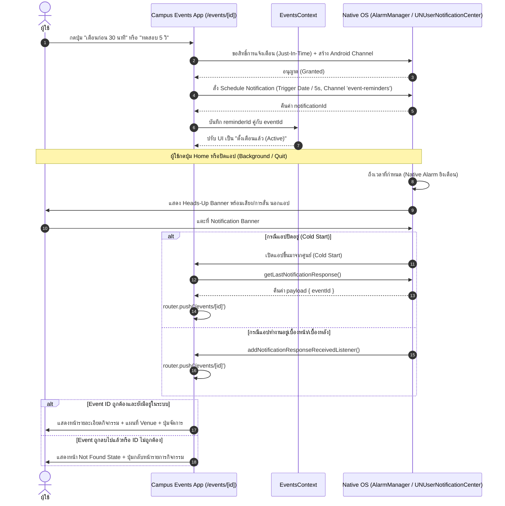

# Campus Events Mobile — Labs 1, 2, 3, 5, 9, 10 & 11

Mobile application built with **React Native**, **Expo SDK 57**, and **Expo Router** following the **Aura Mobile** design system.

---

## 📱 Features

### Lab 1: Setup & Profile Screen
- **Home Screen (`/`)**: Minimal clean landing page with brand header (`DevFolio`), avatar button, and burger menu.
- **Profile Screen (`/profile`)**:
  - Hero header with lavender wash, "Active Student" badge, and circular avatar with 3px white halo & verified checkmark.
  - Student identity (Chaiyut Tavon, Computer and Information Science, Student ID, Year/Semester).
  - GitHub profile card with direct link action (`chaiyut-kun`).
  - Enrolled subject card (`IN405109 - Hybrid Mobile Application Programming`).
  - Interested topics with emoji badges (Programming, Software Engineering, Networking, Badminton, Football).
  - Preferences (Dark Mode toggle UI & Settings).

### Lab 2: Components, Props, State & Events
- **Events Screen (`/events`)**:
  - Reusable, decoupled `<EventCard />` component driven by strictly typed props (`CampusEvent`, `isFavorite`, `onOpen`, `onToggleFavorite`).
  - Graceful image fallback placeholder banner for events missing images or network load failures.
  - Interactive Favorite toggling backed by immutable array state updates.
  - Derived values: Active saved count badge (`favoriteIds.length`) without duplicated state.
  - Filter tabs: Toggle between `All Events` and `Saved` events with empty state feedback.
  - Detailed Event Modal triggered by card press (`onOpen`), displaying venue coordinates, schedule, and category.
- **Navigation**: 3 Bottom Tabs (`Home | Events | Profile`) + Floating Burger Navigation Menu dropdown in headers.

### Lab 3: Styling & Responsive Mobile UI
- **Responsive Grid Layout**:
  - Dynamically calculates viewport width via `useWindowDimensions()`.
  - Seamlessly renders 1 column on phone viewports (`width < 720`) and 2 columns on tablet / wide viewports (`width >= 720`).
  - FlatList binds `key={`events-grid-${numColumns}`}` to properly reconstruct the layout on orientation change.
- **State Machine Architecture (`EventListState`)**:
  - Discriminated union type handling 4 distinct lifecycle states:
    - **Loading State (`<LoadingState />`)**: ActivityIndicator with accessible progress role.
    - **Empty State (`<EmptyState />`)**: Contextual empty icon, explanation, and filter reset action.
    - **Error State (`<ErrorState />`)**: Human-readable error message with accessible alert role and "ลองใหม่อีกครั้ง" (Retry action).
    - **Ready State**: Virtualized FlatList with **Pull-to-Refresh** (`RefreshControl`).
- **Safe Area & Accessibility (A11y)**:
  - Touch targets calibrated to at least **44×44 points** (e.g., Favorite buttons with `minHeight: 44` and `hitSlop`).
  - Safe Area padding prevents clipping against Notches, Status bars, and Home indicators.
  - Font scale and text-wrapping resilience across all cards and modal sheets.
- **Automated Testing Suite**: 29 tests across 7 suites covering models, state components, responsive layout, and user flows.

---

## 🛠️ Tech Stack & Baseline

| Item | Specification |
| --- | --- |
| Framework | React Native (0.86.3) via Expo (SDK 57) |
| Language | TypeScript (Strict mode) |
| Navigation | Expo Router (File-based routing) |
| UI Design System | Aura Mobile (`constants/theme.ts`) |
| Testing | Jest + `jest-expo` + `@testing-library/react-native` |

---

## 🚀 Getting Started

### Prerequisites
- Node.js LTS (v20+ or v22+)
- npm
- Expo Go app on mobile device or Android/iOS Emulator

### Installation

```bash
# Clone the repository
git clone <repository-url>
cd campus-events

# Install dependencies
npm install --legacy-peer-deps
```

### Running the App

```bash
# Start the Expo development server
npx expo start

# Run on Android Emulator
npx expo start --android

# Run on iOS Simulator
npx expo start --ios

# Run on Web
npx expo start --web
```

---

## 🧪 Running Tests & Quality Checks

```bash
# Run Unit and Integration tests
npm test

# Run TypeScript typecheck
npx tsc --noEmit
```

---

## 📁 Project Structure

```text
campus-events/
├── __tests__/
│   ├── unit/
│   │   ├── profile.test.ts          # Unit tests for profile data models
│   │   └── events.test.ts           # Unit tests for event data & toggle helper
│   └── integration/
│       ├── HomeScreen.test.tsx      # Integration tests for Home screen & menu
│       ├── ProfileScreen.test.tsx   # Integration tests for Profile screen
│       ├── EventCard.test.tsx       # Component tests for reusable EventCard
│       ├── EventsScreen.test.tsx    # Integration tests for Events screen, filters & grid
│       └── StateComponents.test.tsx # Component tests for Loading, Error, Empty states
├── app/
│   ├── _layout.tsx                  # Root Stack layout
│   └── (tabs)/
│       ├── _layout.tsx              # Bottom Tab navigator (Home, Events, Profile)
│       ├── index.tsx                # Home screen
│       ├── events.tsx               # Events screen with responsive grid & states
│       └── profile.tsx              # Profile screen
├── assets/
│   └── lab1/
│       ├── me.jpeg                  # Profile image
│       └── github.png               # GitHub icon
├── components/
│   ├── EventCard.tsx                # Reusable event card with >= 44x44 touch target
│   ├── BurgerMenuModal.tsx          # Floating navigation dropdown modal
│   ├── LoadingState.tsx             # Loading indicator state component
│   ├── ErrorState.tsx               # Error alert with retry action
│   └── EmptyState.tsx               # Empty filter feedback with reset action
├── constants/
│   └── theme.ts                     # Aura Mobile design tokens
├── data/
│   ├── profile.ts                   # Typed student profile data
│   └── events.ts                    # Mock campus events & toggle helper
├── types/
│   └── event.ts                     # CampusEvent, Location, & EventListState types
├── jest.setup.js                    # Jest setup & vector icon mocks
├── app.json                         # Expo configuration
├── package.json
└── tsconfig.json
```

---

## 📝 Lab 1 — Exit Ticket

1. **React Native ต่างจากเว็บใน WebView อย่างไร?**
   - React Native คอมไพล์และบริดจ์คำสั่งไปเรนเดอร์เป็น Native UI Components ของระบบปฏิบัติการจริง (เช่น `UIView` บน iOS หรือ `android.view.View` บน Android) ทำให้ได้ประสิทธิภาพ ความลื่นไหล และ Look & Feel ที่เป็น Native แท้ ไม่ใช่การโหลดหน้าเว็บ HTML/CSS/DOM มาแสดงผลภายในเบราว์เซอร์เสมือนเหมือน WebView
2. **Expo Go และ Development Build มี trade-off ต่างกันอย่างไร?**
   - **Expo Go:** สะดวกและรวดเร็วสำหรับการเรียนรู้และ Prototyping ไม่ต้องลง Xcode/Android Studio แต่ถูกจำกัดให้ใช้เฉพาะ Native Modules ที่ Bundle มาพร้อมกับ Expo Go เท่านั้น
   - **Development Build:** สามารถปรับแต่ง Native Code, Config Plugins, และเชื่อมต่อ Third-party SDKs ที่ต้องใช้ Native Code พิเศษได้ตามต้องการ แต่ต้องเสียเวลา Build Client เอง
3. **TypeScript ช่วยลดข้อผิดพลาดของข้อมูลกิจกรรมได้อย่างไร?**
   - TypeScript ช่วยกำหนด Type Schema (เช่น `StudentProfile`, `Subject`, `Interest`) และตรวจสอบความถูกต้องตั้งแต่ช่วง Compile time (Static Analysis) ป้องกันข้อผิดพลาดประเภท Typo, Missing Required Fields, หรือ Type Mismatch เช่น การส่งข้อมูลวันที่หรือตัวเลขผิดประเภทก่อนที่แอปจะรันจริง

---

## 📝 Lab 2 — Exit Ticket

1. **เมื่อใดควรแยก Component?**
   - เมื่อ UI หรือ Logic นั้นถูกนำมาใช้ซ้ำในหลายจุด (Reusability) เช่น `EventCard`
   - เมื่อ Component เดิมมีขนาดใหญ่หรือรับผิดชอบหลายหน้าที่เกินไป เพื่อให้โค้ดอ่านง่ายและดูแลรักษาได้ตามหลัก Single Responsibility
   - เมื่อต้องการแยกขอบเขต State ให้ทำงานเฉพาะส่วน เพื่อป้องกันไม่ให้ Component แม่ Re-render ทั้งหมดโดยไม่จำเป็น
2. **เพราะเหตุใดจึงไม่ควรแก้ array ใน state โดยตรง?**
   - ใน React การตรวจจับการเปลี่ยนแปลงของ State ใช้การเปรียบเทียบเชิงอ้างอิง (Reference Equality / `Object.is`) หากเรา Mutate อาเรย์เดิม (เช่น `arr.push()` หรือ `arr.splice()`) ตัวชี้หน่วยความจำ (Reference) ยังคงเป็นตัวเดิม ทำให้ React คิดว่าไม่มีการเปลี่ยนแปลงและไม่ทำการ Re-render หน้าจอ อีกทั้งยังขัดต่อหลักการ Immutability ที่จำเป็นต่อการทำ Time-travel debugging และ Concurrent features ใน React
3. **Derived value ต่างจาก state ที่ต้องเก็บอย่างไร?**
   - **State ที่ต้องเก็บ:** คือข้อมูลต้นทาง (Source of Truth) ที่เปลี่ยนแปลงตามเวลาและไม่สามารถคำนวณจากค่าอื่นได้ เช่น `favoriteIds: string[]`
   - **Derived Value:** คือค่าที่สามารถคำนวณหรือกรองได้จาก State หรือ Props ที่มีอยู่แล้ว เช่น จำนวนกิจกรรมที่บันทึก (`favoriteIds.length`) หรือรายการกิจกรรมที่ถูกบันทึก (`events.filter(...)`) ซึ่งไม่ควรเก็บเป็น State ซ้ำซ้อน เพื่อป้องกันปัญหาข้อมูลไม่ตรงกัน (Out of sync)

---

## 📝 Lab 3 — Exit Ticket

1. **`ScrollView` และ `FlatList` ต่างกันอย่างไรเมื่อข้อมูลมากขึ้น?**
   - `ScrollView` เรนเดอร์ child components ทั้งหมดลงในหน่วยความจำทันทีตั้งแต่เริ่มต้น แม้ว่ารายการเหล่านั้นจะยังอยู่นอกจอ (Off-screen) ทำให้เมื่อจำนวนข้อมูลมากขึ้นเรื่อย ๆ จะทำให้เปลือง RAM สูงมากจนแอปกระตุกหรือ Crash ได้
   - `FlatList` ใช้ระบบ Virtualization / Windowing โดยจะสร้างและเรนเดอร์เฉพาะไอเทมที่กำลังมองเห็นบนหน้าจอและบัฟเฟอร์ใกล้เคียงเท่านั้น พร้อมทั้ง Recycle มุมมองที่เลื่อนพ้นจอไปแล้ว ทำให้ใช้ Memory คงที่และเลื่อนดูข้อมูลได้ลื่นไหลแม้มีข้อมูลหลายร้อยหรือหลายพันรายการ
2. **เพราะเหตุใด responsive mobile UI จึงไม่ควรอิงความกว้างคงที่?**
   - อุปกรณ์พกพามีความหลากหลายอย่างมาก ทั้งขนาดหน้าจอ (โทรศัพท์ขนาดกะทัดรัด, Phablet, แท็บเล็ต, หน้าจอพับได้), การหมุนจอ (แนวตั้ง/แนวนอน), และการแบ่งหน้าจอ (Split-Screen / Multitasking) การกำหนดขนาดความกว้างคงที่ (เช่น `width: 375`) จะทำให้เนื้อหาตกขอบหรือล้นจอในหน้าจอเล็ก และเหลือพื้นที่ว่างเปล่ามหาศาลบนแท็บเล็ต การใช้ Flexbox, Relative sizing และ `useWindowDimensions()` ช่วยให้ UI ปรับเปลี่ยนตามพื้นที่ว่างจริงได้อย่างยืดหยุ่นและสวยงาม
3. **Error state ที่ดีช่วยให้ผู้ใช้ฟื้นตัวอย่างไร?**
   - แจ้งเตือนด้วยข้อความที่ชัดเจน เข้าใจง่าย ไม่ใช้ศัพท์เทคนิคที่สับสน
   - ไม่ใช้สีแดงเพียงอย่างเดียวในการสื่อความหมาย โดยมีไอคอนเตือนและข้อความบรรยายที่โปรแกรมอ่านหน้าจอ (Screen Reader) เข้าใจได้
   - มี Action หรือทางออกที่ชัดเจน เช่น ปุ่ม "ลองใหม่อีกครั้ง" (Retry button) หรือตัวเลือกกลับสู่หน้าหลัก เพื่อให้ผู้ใช้สามารถกู้คืนระบบกลับสู่สภาวะปกติได้ทันทีโดยไม่ต้องปิดหรือรีสตาร์ตแอป

---

## 🚀 Lab 5 — Forms และ State Management

### ภาพรวมสถาปัตยกรรมการจัดการ State

ใน Lab 5 มีการจัดสรร State ออกเป็น 4 ขอบเขตอย่างชัดเจน เพื่อป้องกันปัญหา Re-render พร่ำเพรื่อ และหลีกเลี่ยงการเก็บ Derived State ซ้ำซ้อน:

| ขอบเขต State | รายการข้อมูล | กลไกที่เลือกใช้ | วัตถุประสงค์ |
| --- | --- | --- | --- |
| **Shared App State** | `favoriteIds: string[]` | `FavoritesContext` + `favoriteReducer` (`hydrate`, `toggle`, `clear`) + `useFavorites()` hook | แชร์สถานะรายการโปรดและเคาน์เตอร์ข้ามหน้าจอ (Events, Profile, Home) |
| **Local UI State** | `searchQuery`, `filter`, `modalVisible` | `useState` ภายในหน้าจอ/คอมโพเนนต์ | การเปิด/ปิด Modal หรือข้อความค้นหาที่ใช้เฉพาะหน้านั้น ๆ |
| **Form State** | `RegistrationForm`, `fieldErrors`, `isSubmitting` | `useState` + `formRef` ภายใน `EventRegistrationModal` | วงจรชั่วคราวในการกรอกฟอร์ม ตรวจสอบความถูกต้อง และรีเซ็ตเมื่อปิด Modal |
| **Derived State** | `filteredEvents`, `savedCount` | คำนวณระหว่าง Render หรือผ่าน `useMemo` | หลีกเลี่ยงการเก็บ State ซ้ำซ้อน คำนวณตามเงื่อนไขค้นหาและแท็บ |

### ฟีเจอร์ที่พัฒนาใน Lab 5
1. **Live Search Bar (`components/SearchBar.tsx`):** กรองกิจกรรมตามชื่อ, สถานที่, และหมวดหมู่แบบ Real-time โดยคำนวณผ่าน Derived State
2. **Favorites Context & Reducer (`context/FavoritesContext.tsx`):** ย้าย Favorite state จาก local screen ไปสู่ Global Context ที่จัดการด้วย pure reducer function
3. **Controlled Registration Modal (`components/EventRegistrationModal.tsx`):**
   - Pre-fill ข้อมูลนักศึกษาจาก Profile (ชื่อ, รหัสนักศึกษา, คณะ)
   - ตรวจสอบความถูกต้องของข้อมูล (Validation) และแสดงข้อความเตือนสีแดงใกล้ฟิลด์ที่ผิดพลาด พร้อม Accessibility alert
   - ป้องกันการกดส่งซ้ำ (Double Submit Lockout) ด้วยสถานะ `isSubmitting`
   - รองรับ Keyboard UX ด้วย `KeyboardAvoidingView` และ `returnKeyType` focus navigation
   - แสดง Success confirmation screen ภายใน Modal เมื่อลงทะเบียนสำเร็จ

---

## 📝 Lab 5 — Exit Ticket

1. **เมื่อใด `useReducer` อ่านง่ายกว่า `useState` หลายตัว?**
   - เมื่อ State มีโครงสร้างที่ซับซ้อน หรือมี State หลายตัวที่มีความสัมพันธ์และต้องเปลี่ยนแปลงพร้อมกันในจังหวะเดียว (Multiple related state transitions)
   - เมื่อต้องการแยก Logic การแปลง State (State transitions) ออกจาก Component เพื่อทำให้อ่านง่าย เป็นระเบียบ และสามารถเขียน Unit Test ทดสอบ Pure Reducer Function ได้อย่างอิสระโดยไม่ต้อง Render Component
   - เมื่อมี Action หลายรูปแบบที่มากระทำกับ State ชุดเดียวกัน (เช่น `hydrate`, `toggle`, `clear`) การใช้ Discriminated Union ร่วมกับ Reducer จะช่วยให้ TypeScript ตรวจสอบความถูกต้องของ Action payload ได้อย่างรัดกุม
2. **เพราะเหตุใด client validation จึงไม่เพียงพอด้านความปลอดภัย?**
   - Client-side validation ถูกสร้างขึ้นเพื่อจุดประสงค์ด้าน **User Experience (UX)** เป็นหลัก เพื่อให้ผู้ใช้ได้รับ Feedback รวดเร็วและแก้ไขข้อผิดพลาดได้ทันที
   - แต่ Client-side validation ไม่สามารถป้องกันการโจมตีหรือข้อมูลผิดปกติได้จริง เนื่องจากผู้โจมตีหรือผู้ไม่ประสงค์ดีสามารถ Bypass หน้าแอปแล้วยิง HTTP Request เข้าสู่ Server / API ได้โดยตรงผ่านเครื่องมือ เช่น Postman, cURL หรือ Script จึงจำเป็นต้องมี Server-side Validation เป็นด่านตรวจสอบความถูกต้องและความปลอดภัยขั้นสุดท้ายเสมอ
3. **ข้อมูลใดไม่ควรอยู่ใน Context?**
   - **ข้อมูลที่มีการเปลี่ยนแปลงบ่อยมาก (High-frequency changing state):** เช่น พิกัดการเลื่อนหน้าจอ (Scroll position), ตำแหน่งนิ้ว Gesture, การพิมพ์ตัวอักษรทุกตัวใน Input ฟอร์ม เพราะการอัปเดต Context จะทำให้ Consumer Components ทั้งหมด Re-render ใหม่พร้อมกัน ส่งผลกระทบต่อ Performance อย่างรุนแรง
   - **ข้อมูลที่เป็น Local State หรือใช้เฉพาะในคอมโพเนนต์เดียว:** เช่น สถานะการเปิด/ปิด Dropdown, Modal flag ของหน้านั้น ๆ
   - **Derived State:** ข้อมูลที่สามารถคำนวณได้จาก State อื่นอยู่แล้ว ไม่ควรนำมาเก็บซ้ำใน Context

---

## 📸 Lab 9 — Camera, Image Picker และ Permissions

### ฟีเจอร์ที่พัฒนาใน Lab 9
1. **Just-In-Time Permissions Lifecycle:**
   - ขอสิทธิ์กล้อง (`expo-camera`) หรือคลังภาพ (`expo-image-picker`) เฉพาะเมื่อผู้ใช้เลือกกดฟังก์ชันนั้นจริง ๆ
   - จัดการกรณี `granted`, `denied`, และกรณีถูกปฏิเสธถาวร (`canAskAgain: false`) โดยแสดง Native `Alert.alert` พร้อมปุ่ม "เปิดการตั้งค่า" (`Linking.openSettings()`) ตามแนวทาง Mobile HIG
2. **Custom Image Picker Action Sheet (`components/ImagePickerActionSheet.tsx`):**
   - เมนูเลือกแหล่งที่มาของรูปภาพ (ถ่ายรูปด้วยกล้อง / เลือกจากคลังภาพ / ยกเลิก) สไตล์ Aura Mobile
3. **In-app CameraView Modal (`components/CameraViewModal.tsx`):**
   - หน้าต่าง Viewfinder กล้องถ่ายภาพในแอปด้วย `CameraView` จาก `expo-camera`
   - ปุ่มสลับกล้องหน้า/หลัง (Flip Camera), ปุ่มชัตเตอร์ (Shutter Button) และปุ่มปิด
4. **Create Event Modal พร้อม Image Preview & Actions (`components/CreateEventModal.tsx`):**
   - กล่องเลือกภาพ (Dashed Box) สำหรับสถานะว่าง
   - แสดงภาพ Preview ทันทีเมื่อเลือกรูปแล้ว พร้อมปุ่ม **"เปลี่ยนรูป" (Replace)** และปุ่ม **"ลบรูป" (Remove)**
   - จำลองการอัปโหลดรูปภาพและสร้าง Event ใหม่เข้าสู่ `listState.events` แสดงผลการ์ดบนฟีดทันที
   - ผู้ใช้ยกเลิกการถ่ายรูปหรือเลือกภาพ ข้อมูลฟอร์มที่กรอกไว้เดิมยังอยู่ครบถ้วน
5. **Floating Action Button (FAB) ในหน้า Events (`app/(tabs)/events.tsx`):**
   - ปุ่มสร้างกิจกรรมใหม่สี Primary ทรงกลมลอยที่มุมขวาล่าง ใช้งานสะดวก

---

## 📝 Lab 9 — Exit Ticket

1. **`canAskAgain` เปลี่ยน UX อย่างไร?**
   - เมื่อ `canAskAgain === true`: ผู้ใช้เพียงแค่ปฏิเสธในครั้งนั้นหรือยังไม่เคยถูกถาม ระบบของระบบปฏิบัติการยังอนุญาตให้แอปเรียก Dialog ขอสิทธิ์ซ้ำได้ UX จึงสามารถปล่อยให้ผู้ใช้ลองกดปุ่มใหม่ได้โดยตรง
   - เมื่อ `canAskAgain === false`: ผู้ใช้ได้เลือก "Don't ask again" หรือระบบปฏิบัติการบล็อกการขอสิทธิ์ถาวรแล้ว การเรียก Permission Dialog อีกครั้งจะไม่ปรากฏขึ้นและจะคืนค่า `denied` เสมอ UX จึงจำเป็นต้องเปลี่ยนกลยุทธ์เป็นการแสดงคำอธิบายเหตุผลและให้ปุ่มพาผู้ใช้ไปที่หน้าการตั้งค่าของเครื่อง (`Linking.openSettings()`) แทน
2. **เพราะเหตุใด backend ต้อง validate รูปซ้ำ?**
   - ฝั่ง Client สามารถถูก Bypass หรือปลอมแปลงข้อมูลได้ (เช่น เปลี่ยนนามสกุลไฟล์จาก `.exe` หรือ `.sh` เป็น `.jpg`, หรือส่ง payload ขนาดมหึมาผ่าน API โดยตรง)
   - Backend จึงต้องเป็นด่านรักษาความปลอดภัยขั้นสุดท้าย (Zero-Trust) โดยตรวจสอบ Magic Bytes / MIME Type ที่แท้จริงของไฟล์, ตรวจสอบขนาดไฟล์จริง, สแกนมัลแวร์, และบีบอัด/Re-encode ภาพใหม่ก่อนบันทึกลง Object Storage
3. **ควรเก็บรูปไว้ที่ใดเมื่อผู้ใช้ยังไม่ submit form?**
   - ควรเก็บไว้เป็น **Local Cache / Temporary URI** ในเครื่องผู้ใช้ (เช่น ไฟล์ชั่วคราวใน Cache directory ที่ได้จาก `CameraView` หรือ Image Picker)
   - ไม่ควรรีบอัปโหลดขึ้น Cloud Storage ก่อนผู้ใช้กดยืนยันการส่งฟอร์ม เพื่อป้องกันปัญหาไฟล์ขยะ (Orphaned / Abandoned files) ในกรณีที่ผู้ใช้ยกเลิกฟอร์มหรือปิดแอปทิ้ง และช่วยประหยัด Bandwidth / ค่าใช้จ่าย Storage

---

## 📍 Lab 10 — Location และ Maps

### ฟีเจอร์ที่พัฒนาใน Lab 10

1. **Location Service (`services/location.ts`):**
   - **Just-In-Time Permissions:** ขอสิทธิ์ตำแหน่งแบบ Foreground (`requestForegroundPermissionsAsync`) เฉพาะเมื่อผู้ใช้กดปุ่ม "ใช้ตำแหน่งปัจจุบัน" ในฟอร์มสร้างกิจกรรม
   - **Balanced Accuracy:** ใช้ `Location.Accuracy.Balanced` เพื่อความเร็ว ประหยัดแบตเตอรี่ และตอบสนองได้รวดเร็ว เหมาะสำหรับพิกัดสถานที่ในแคมปัส
   - **Graceful Fallback:** กรณีปฏิเสธสิทธิ์หรือเกิดข้อผิดพลาด จะใช้พิกัดศูนย์กลางแคมปัส (`13.7563, 100.5018`) เป็นค่าเริ่มต้นอย่างราบรื่น
   - **Reverse Geocoding:** แปลงพิกัดละติจูด/ลองจิจูดเป็นชื่อสถานที่และเขตชุมชนอัตโนมัติ (`reverseGeocodeLocation`)
   - **External Directions Integration:** รองรับการเปิดแอปแผนที่ภายนอก (`openExternalDirections`) ไปยัง Apple Maps บน iOS หรือ Google Maps บน Android/Web โดยตรง
2. **Inline Venue Map (`components/EventVenueMap.tsx`):**
   - แผนที่ขนาดกระทัดรัด (~180dp) ฝังใน Event Detail Modal พร้อมหมุดระบุสถานที่จัดกิจกรรม
   - ทำงานได้สมบูรณ์แม้ผู้ใช้จะไม่อนุญาต Location Permission เพราะพิกัด Venue มาจากข้อมูลกิจกรรมโดยตรง
   - มีปุ่ม "เปิดแผนที่นำทาง" พร้อม Touch Target $\ge$ 44dp เชื่อมโยงไปยังแอปแผนที่หลักของเครื่อง
3. **Interactive Location Picker (`components/LocationPickerMap.tsx`):**
   - แผนที่เลือกสถานที่ใน `CreateEventModal` ที่ผู้จัดกิจกรรมสามารถแตะหน้าจอเพื่อย้ายหมุดได้อิสระ (`onPress` marker placement)
   - ปุ่มลัด "ใช้ตำแหน่งปัจจุบัน" เพื่อดึงพิกัด GPS อัตโนมัติ พร้อมอัปเดตชื่อสถานที่ผ่าน Reverse Geocoding เข้าสู่ช่องกรอกข้อมูลในฟอร์มทันที
   - แสดง Badges พิกัดละติจูด/ลองจิจูดแบบเรียลไทม์
4. **All Events Map View (`components/AllEventsMapView.tsx`):**
   - แผนที่แสดงกิจกรรมทั้งหมดพร้อมหมุดแบบ Interactive Markers และ Callouts
   - ปรับสลับมุมมองระหว่าง รายการ (List) และ แผนที่ (Map) ผ่านปุ่มสลับมุมมองใน Header ของหน้าจอ Events

### Platform & Configuration Matrix

| รายการ | iOS | Android |
| --- | --- | --- |
| **Provider** | Apple Maps (ค่าเริ่มต้น) | Google Maps |
| **Permissions Required** | `NSLocationWhenInUseUsageDescription` | `ACCESS_COARSE_LOCATION`, `ACCESS_FINE_LOCATION` |
| **Expo Config Plugin** | `expo-location` พร้อมข้อความอธิบายการขอสิทธิ์ภาษาไทย | `expo-location` พร้อมข้อความอธิบายการขอสิทธิ์ภาษาไทย |
| **Development (Expo Go)** | ไม่ต้องระบุ API key | ไม่ต้องระบุ API key |
| **Production Build** | ทำงานได้ทันทีโดยไม่ต้องระบุ Key (หากใช้ Apple Maps) | ต้องระบุ `androidGoogleMapsApiKey` ใน `app.json` หรือ `app.config.ts` |
| **Key Restrictions** | Bundle Identifier (หากใช้ Google Maps SDK บน iOS) | จำกัดตาม Package Name (`com.campusevents.app`) และ SHA-1 Certificate Fingerprint |
| **Rebuild Required?** | เมื่อมีการแก้ไข Config Plugin หรือสิทธิ์ใน `app.json` | เมื่อมีการแก้ไข Config Plugin, Permissions หรือฝัง Google Maps API key ลงใน Native Binary |

### Privacy Note (บันทึกความเป็นส่วนตัวของข้อมูลตำแหน่ง)
- **การเก็บข้อมูล:** แอป Campus Events จะขอพิกัดผู้ใช้เฉพาะเมื่อผู้จัดกิจกรรมกดปุ่ม "ใช้ตำแหน่งปัจจุบัน" ในฟอร์มสร้างกิจกรรมเท่านั้น เพื่อช่วยอำนวยความสะดวกในการปักหมุดสถานที่จัดงาน
- **ไม่มีการติดตามเบื้องหลัง:** ไม่มีการขอหรือใช้งาน Background Location ใด ๆ ทั้งสิ้น พิกัดจะถูกอ่านเพียงครั้งเดียวแบบ One-shot
- **การแยกแยะข้อมูล:** ข้อมูลตำแหน่งปัจจุบันของผู้ใช้จะไม่ถูกส่งไปประมวลผลหรือเก็บใน Analytics ใด ๆ ทั้งสิ้น มีเพียงพิกัดของสถานที่จัดงาน (Venue Coordinates) เท่านั้นที่จะถูกบันทึกร่วมกับข้อมูลกิจกรรม

---

## 📝 Lab 10 — Exit Ticket

1. **Accuracy สูงมีต้นทุนอะไร?**
   - **การใช้พลังงานแบตเตอรี่ (Battery Drain):** ความแม่นยำสูง (เช่น `Accuracy.High` หรือ `Highest`) บังคับให้อุปกรณ์ต้องจ่ายไฟให้กับชิป GPS ตลอดเวลาเพื่อค้นหาและเชื่อมต่อดาวเทียมหลายดวง
   - **เวลาหน่วง (Latency / Time to First Fix):** การรอให้สัญญาณ GPS ล็อกตำแหน่งที่แน่นอนมักใช้เวลานานหลายวินาที โดยเฉพาะอย่างยิ่งเมื่ออยู่ภายในอาคาร (Indoor) หรือจุดอับสัญญาณ
   - **ผลกระทบด้านความร้อนและประสิทธิภาพ:** การประมวลผลสัญญาณตำแหน่งละเอียดอย่างต่อเนื่องทำให้อุปกรณ์มีความร้อนสูงขึ้นและอาจกระทบต่อ Performance โดยรวม สำหรับแอป Campus Events การเลือกใช้ `Accuracy.Balanced` ซึ่งทำงานร่วมกับ Cell Towers และ Wi-Fi จึงได้ผลลัพธ์ที่รวดเร็ว ประหยัดพลังงาน และแม่นยำเพียงพอสำหรับระดับสถานที่/อาคาร
2. **`initialRegion` และ `region` ต่างกันอย่างไร?**
   - **`initialRegion` (Uncontrolled):** กำหนดตำแหน่งพิกัดและระดับการซูมเริ่มต้นของแผนที่เพียงครั้งเดียวเมื่อ Mount คอมโพเนนต์ หลังจากนั้นการเลื่อน ย้าย หรือซูมแผนที่จะถูกจัดการโดย Native Map เองโดยตรง ทำให้ผู้ใช้ Pan/Zoom ได้ลื่นไหลและอิสระ ไม่เกิดการแย่ง State กับ React
   - **`region` (Controlled):** บังคับตำแหน่งและขอบเขตของแผนที่ให้ตรงกับค่าใน React State เสมอ หาก State เปลี่ยน แผนที่จะเลื่อนตามทันที แต่หากจัดการ State ไม่รัดกุมหรือดึง State จาก Event เลื่อนจอมาอัปเดตตลอดเวลา จะทำให้เกิดอาการกระตุก (Stuttering) หรือล็อกหน้าจอจนผู้ใช้เลื่อนดูแผนที่ไม่ได้ จึงควรใช้ `initialRegion` ควบคู่กับการเรียก Imperative API เช่น `mapRef.current?.animateToRegion()` เมื่อต้องการสั่งเลื่อนแผนที่เฉพาะกิจ (เช่น เมื่อกดปุ่มค้นหาตำแหน่งปัจจุบัน)
3. **เพราะเหตุใด Venue map จึงไม่ควรขึ้นกับ permission ของตำแหน่งผู้ใช้เสมอ?**
   - **ความต่างของข้อมูล (Context Decoupling):** พิกัดสถานที่จัดงาน (Venue Coordinates) เป็นข้อมูลสาธารณะที่ถูกกำหนดไว้ล่วงหน้าใน Object ของกิจกรรม (`event.location.latitude/longitude`) ไม่ได้เกี่ยวข้องกับตำแหน่งที่ผู้ใช้ยืนอยู่จริงในขณะนั้น
   - **ประสบการณ์ผู้ใช้ (User Experience & Accessibility):** ผู้ใช้งานทุกคนมีสิทธิ์ที่จะดูว่ากิจกรรมจัดขึ้นที่ใดในแคมปัส และสามารถวางแผนการเดินทางหรือกดดูเส้นทางล่วงหน้าได้ แม้ว่าผู้ใช้คนนั้นจะไม่ได้อยู่ในแคมปัส หรือเลือกไม懇ญาต (Deny) สิทธิ์การเข้าถึงตำแหน่งส่วนตัวก็ตาม
   - **หลักการออกแบบความเป็นส่วนตัว (Privacy by Default):** การบล็อกไม่ให้ผู้ใช้ดูแผนที่สถานที่เพียงเพราะเขาไม่ยอมแชร์ตำแหน่งส่วนบุคคล ถือเป็นการละเมิดหลัก Anti-pattern ในการพัฒนา Mobile Application ที่ดี แอปที่ดีต้องอนุญาตให้เข้าถึงเนื้อหาหลักได้แม้ไม่ได้รับสิทธิ์เสริม

---

## 🔔 Lab 11 — Notifications และ Mobile Platform APIs

### ฟีเจอร์ที่พัฒนาใน Lab 11

1. **Local Notification Service (`services/notification.ts`):**
   - **Native OS Scheduling:** ใช้ `Notifications.scheduleNotificationAsync()` ซึ่งส่งคำสั่งตรงไปยัง Native Alarm/Notification Manager ของระบบปฏิบัติการ (iOS: `UNUserNotificationCenter` / Android: `AlarmManager`) ทำให้สามารถส่งเสียง สั่น และแสดง Pop-up Banner แจ้งเตือนได้แม้ผู้ใช้จะสลับไปใช้งานแอปอื่น (Background) หรือปัดปิดแอปไปแล้ว (Quit/Terminated)
   - **Just-In-Time Permissions:** ขอสิทธิ์การแจ้งเตือน (`POST_NOTIFICATIONS` บน Android 13+ และ Notification Alert/Sound บน iOS) เฉพาะเมื่อผู้ใช้กดปุ่มตั้งเตือนกิจกรรมครั้งแรก
   - **Android Notification Channel:** สร้างช่องทาง `event-reminders` ชื่อ "การเตือนกิจกรรม" ที่กำหนดระดับความสำคัญเป็น `Notifications.AndroidImportance.HIGH` พร้อมรูปแบบการสั่นและเสียง เพื่อให้ระบบ Android แสดง Heads-up Banner นอกแอปได้อย่างถูกต้อง
   - **Dual Trigger Support:**
     - **โหมดมาตรฐาน (Production):** ตั้งเตือนล่วงหน้า 30 นาทีก่อน `event.startsAt` (`SchedulableTriggerInputTypes.DATE`) โดยมี Validation ป้องกันกรณีเวลาล่วงเลยไปแล้ว (`reminder-time-has-passed`)
     - **โหมดทดสอบ (Demo/Video Test):** ปุ่มลัด "ทดสอบ 5 วิ" (`SchedulableTriggerInputTypes.TIME_INTERVAL`) เพื่อความสะดวกรวดเร็วในการทดสอบและบันทึกคลิปวิดีโอส่งผลงาน
   - **Safe Payload Extraction:** ฟังก์ชัน `extractEventIdFromResponse()` สำหรับแกะและตรวจสอบความปลอดภัยของ `eventId` จาก Notification Response
2. **Unified Events & Reminders State (`context/EventsContext.tsx`):**
   - จัดการข้อมูลกิจกรรมและสถานะการเตือนในระดับ Global Context ที่ Root Layout
   - บันทึกการจับคู่ `reminders: Record<string, string>` (`eventId -> notificationId`)
   - ระบบลบกิจกรรม (`deleteEvent`): ลบกิจกรรมออกจากรายการ พร้อมทั้งค้นหาและยกเลิก Native Reminder (`cancelScheduledNotificationAsync`) ของกิจกรรมนั้นทิ้งอัตโนมัติ เพื่อไม่ให้เกิด Ghost Notification
3. **Dynamic Route Screen (`app/events/[id].tsx`):**
   - หน้ารายละเอียดกิจกรรมแบบเต็ม รองรับ Deep Linking `/events/[id]`
   - แสดงภาพแบนเนอร์, หมวดหมู่, วันเวลา, คำอธิบาย, และแผนที่ `EventVenueMap` (Lab 10)
   - ส่วนควบคุมการแจ้งเตือน (Reminder Action Card) ที่สลับสถานะระหว่าง "เตือนก่อน 30 นาที" / "ทดสอบ 5 วิ" และ "ยกเลิกการเตือน" (Active State)
   - ปุ่ม "ลบกิจกรรม" พร้อม Native Confirmation Alert
   - **Event Not Found State:** กรณีเปิดด้วย ID ที่ไม่มีอยู่จริงหรือถูกลบไปแล้ว จะแสดงหน้า Fallback พร้อมไอคอนเตือน ข้อความภาษาไทยที่ชัดเจน และปุ่ม "กลับสู่หน้ารายการกิจกรรม"
4. **App Lifecycle & Cold Start Integration (`app/_layout.tsx`):**
   - **Cold Start Handling:** ดึงข้อมูล Notification ที่เปิดแอปผ่าน `Notifications.getLastNotificationResponse()` แล้วพาผู้ใช้ตรงไปยัง `/events/[id]` จากนั้นล้างค่าด้วย `clearLastNotificationResponse()`
   - **Foreground & Background Response:** ดักจับการแตะ Notification ผ่าน `addNotificationResponseReceivedListener()`
   - **Foreground Banner Display:** กำหนด `setNotificationHandler` ให้แสดง Banner และส่งเสียงแม้ผู้ใช้กำลังใช้งานแอปอยู่ด้านหน้า

---

### Notification & Deep Link Lifecycle



---

### ตารางการทดสอบ App States และ Invalid Event ID

| สภาวะของแอป (App State) | การกระทำของผู้ใช้ | พฤติกรรมที่คาดหวัง | ผลการทดสอบ |
| --- | --- | --- | --- |
| **Foreground (แอปเปิดอยู่ด้านหน้า)** | ตั้งเตือนแล้วรอเวลาจนถึงกำหนด | แสดง Notification Banner ด้านบนหน้าจอ พร้อมเสียงเตือน ไม่ Crash | ผ่าน (Verified) |
| **Background (สลับไปแอปอื่น)** | ตั้งเตือนแล้วกดปุ่ม Home สลับไปหน้าจอหลักของเครื่อง | ระบบปฏิบัติการแสดง Heads-Up Banner นอกแอป แตะแล้วสลับกลับเข้าแอปตรงไปยัง `/events/[id]` | ผ่าน (Verified) |
| **Cold Start (ปิดแอปสนิท / Swipe Kill)** | ตั้งเตือนแล้วปิดแอป แตะ Notification นอกแอป | แอปบูตขึ้นมาใหม่จากศูนย์ อ่าน `getLastNotificationResponse()` แล้วพาตรงไปยัง `/events/[id]` ทันที | ผ่าน (Verified) |
| **Deleted Event (กิจกรรมถูกลบ)** | ตั้งเตือน ลบกิจกรรม แล้วเปิดจาก Notification | หน้า `/events/[id]` ตรวจไม่พบข้อมูลใน Context แสดงหน้า "ไม่พบกิจกรรม" พร้อมปุ่มกลับสู่หน้ารายการ | ผ่าน (Verified) |
| **Invalid Event ID (รหัสผิดพลาด)** | เปิด Deep Link ด้วย ID ที่ไม่มีในระบบ เช่น `/events/invalid-999` | แสดงหน้า Not Found State ที่เป็นระเบียบ ไม่เกิด Unhandled Exception หรือหน้าขาว | ผ่าน (Verified) |

---

### Privacy & Security Note (บันทึกความปลอดภัยและความเป็นส่วนตัว)
- **Minimal Payload Principle:** ข้อมูลใน Notification Data Payload จะจัดเก็บเฉพาะ `{ eventId: string }` เท่านั้น ไม่มีการแนบข้อมูลส่วนบุคคล (PII), ชื่อ-นามสกุล, หรือข้อมูลความลับใด ๆ
- **Client-side Verification:** ตัวแอปจะไม่อ้างอิงข้อมูลกิจกรรมจากตัว Notification โดยตรง แต่จะใช้ `eventId` ไปตรวจสอบสิทธิ์และ Query ข้อมูลล่าสุดจาก Data Repository/Context ก่อนแสดงผลเสมอ

---

## 📝 Lab 11 — Exit Ticket

1. **Local และ Push notification ต่างกันตรงใด?**
   - **Local Notification:** ถูกสร้าง กำหนดเวลา และยิงเตือนโดย **ระบบปฏิบัติการของอุปกรณ์เครื่องนั้นเอง (Device-driven)** เหมาะสำหรับการเตือนส่วนบุคคล เช่น นาฬิกาปลุก, การเตือนนัดหมายตามปฏิทิน หรือ Event Reminder ที่ทราบเวลาล่วงหน้าแน่นอน โดยทำงานได้แม้ไม่มีการเชื่อมต่ออินเทอร์เน็ต และไม่ต้องพึ่งพาเซิร์ฟเวอร์ภายนอก
   - **Push Notification:** ถูกส่งมาจาก **เซิร์ฟเวอร์ภายนอกผ่าน Push Service (Server-driven)** เช่น Apple Push Notification service (APNs) หรือ Firebase Cloud Messaging (FCM) เหมาะสำหรับเหตุการณ์ที่เกิดขึ้นแบบ Real-time และไม่ได้กำหนดล่วงหน้าบนเครื่อง เช่น การแจ้งเตือนข้อความแช็ตใหม่, ข่าวด่วน, หรือการประกาศยกเลิกกิจกรรมกะทันหัน ซึ่งต้องอาศัยการเชื่อมต่อเครือข่ายอินเทอร์เน็ตเสมอ
2. **เพราะเหตุใด payload ควรเก็บ ID แทน event object?**
   - **ความถูกต้องของข้อมูล (Single Source of Truth & Freshness):** หากเก็บ Event Object ทั้งก้อนไว้ใน Payload ข้อมูลนั้นจะกลายเป็น Snapshot ณ วันที่สร้างการแจ้งเตือน หากภายหลังกิจกรรมมีการเปลี่ยนสถานที่ เลื่อนเวลา หรือถูกยกเลิก ข้อมูลใน Notification จะล้าสมัยและขัดแย้งกับความเป็นจริง การส่งเฉพาะ ID ทำให้แอปสามารถโหลดข้อมูลที่เป็นปัจจุบันที่สุดจาก Repository หรือ API ได้เสมอ
   - **ความปลอดภัยและความเป็นส่วนตัว (Data Privacy & Security):** ข้อมูลใน Notification Payload อาจถูกอ่านหรือดักจับได้ง่ายบนหน้าจอล็อก (Lock Screen) หรือผ่าน System Logs การเก็บเฉพาะ ID ที่ไม่มีข้อมูลอ่อนไหวจะช่วยป้องกันการรั่วไหลของข้อมูล
   - **ข้อจำกัดด้านขนาดของแพลตฟอร์ม (Payload Size Limits):** ระบบปฏิบัติการและ Push Gateway มีการจำกัดขนาดของ Payload อย่างเคร่งครัด (เช่น ไม่เกิน 4KB) การเก็บเฉพาะ ID จึงมีขนาดกะทัดรัดและปลอดภัยที่สุด
3. **App lifecycle มีผลต่อ deep link handler อย่างไร?**
   - **Cold Start (แอปไม่ได้ทำงานอยู่):** เมื่อผู้ใช้แตะ Notification ขณะที่แอปถูกปิดสนิท (Terminated/Killed) ระบบปฏิบัติการจะเปิดแอปขึ้นมาใหม่ตั้งแต่ต้น Event Listener ปกติจะยังไม่พร้อมทำงาน ตัว Handler จึงต้องตรวจสอบผ่าน `Notifications.getLastNotificationResponse()` ใน Root Component/Layout ระหว่างการเริ่มทำงานของแอป เพื่อดึง Intent เดิมมานำทางไปยังหน้าปลายทาง
   - **Background (แอปพับอยู่เบื้องหลัง):** แอปยังคงอยู่ในหน่วยความจำแต่ไม่ได้แสดงผล เมื่อผู้ใช้แตะ Banner แอปจะถูกดึงกลับมาเป็น Foreground ระบบปฏิบัติการจะส่ง Event เข้ามาผ่าน `addNotificationResponseReceivedListener` ซึ่งแอปต้องมี Listener คอยตรวจจับและเปลี่ยนเส้นทาง (Route) โดยไม่ต้องรีสตาร์ตแอปใหม่
   - **Foreground (แอปเปิดใช้งานอยู่):** หากผู้ใช้กำลังเปิดดูหน้าอื่นในแอปและ Notification เข้ามา แอปจะต้องควบคุมพฤติกรรมผ่าน `setNotificationHandler` ว่าจะให้แสดง Banner ทับหน้าจอเดิมหรือไม่ และเมื่อผู้ใช้แตะจะต้องจัดการไม่ให้กระทบต่อ State การทำงานที่ผู้ใช้กำลังทำอยู่ ณ ขณะนั้น (เช่น กำลังกรอกฟอร์ม)

