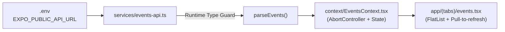

# Campus Events Mobile — Comprehensive Technical Summary (Labs 1 – 11)

เอกสารฉบับนี้รวบรวมและสังเคราะห์องค์ความรู้เชิงเทคนิค (Technical Architecture), เครื่องมือและไลบรารี, ขั้นตอนการพัฒนา (Implementation Methodology), สิ่งที่ได้เรียนรู้ (Key Learnings), ตลอดจนบันทึกการแก้ปัญหาเชิงปฏิบัติการจริง (Troubleshooting & Bug Fixes) จากการพัฒนาแอปพลิเคชัน **Campus Events** ด้วย **Expo SDK 57 / React Native** ตั้งแต่สัปดาห์ที่ 1 ถึงสัปดาห์ที่ 11 ไว้อย่างครบถ้วน

---

## สารบัญ (Table of Contents)

1. [ภาพรวมสถาปัตยกรรมและ Tech Stack Baseline](#1-ภาพรวมสถาปัตยกรรมและ-tech-stack-baseline)
2. [เจาะลึกเนื้อหาเชิงเทคนิครายแล็บ (Labs 1 – 11)](#2-เจาะลึกเนื้อหาเชิงเทคนิครายแล็บ-labs-1--11)
   - [Lab 1: Mobile Development, React Native และ Expo](#lab-1-mobile-development-react-native-และ-expo)
   - [Lab 2: Components, Props, State และ Events](#lab-2-components-props-state-และ-events)
   - [Lab 3: Styling และ Responsive Mobile UI](#lab-3-styling-และ-responsive-mobile-ui)
   - [Lab 4: Expo Router และ Navigation](#lab-4-expo-router-และ-navigation)
   - [Lab 5: Forms และ State Management](#lab-5-forms-และ-state-management)
   - [Lab 6: REST API และ Networking](#lab-6-rest-api-และ-networking)
   - [Lab 7: Local Storage และ Offline Applications](#lab-7-local-storage-และ-offline-applications)
   - [Lab 8: Authentication และ Mobile Security](#lab-8-authentication-และ-mobile-security)
   - [Lab 9: Camera, Image Picker และ Permissions](#lab-9-camera-image-picker-และ-permissions)
   - [Lab 10: Location และ Maps](#lab-10-location-และ-maps)
   - [Lab 11: Notifications และ Mobile Platform APIs](#lab-11-notifications-และ-mobile-platform-apis)
3. [Storage Matrix & Security Guidelines](#3-storage-matrix--security-guidelines)
4. [บันทึกปัญหาเชิงปฏิบัติการและการแก้ไขจริง (Troubleshooting Case Studies)](#4-บันทึกปัญหาเชิงปฏิบัติการและการแก้ไขจริง-troubleshooting-case-studies)
5. [สรุป Testing Strategy & Quality Assurance](#5-สรุป-testing-strategy--quality-assurance)

---

## 1. ภาพรวมสถาปัตยกรรมและ Tech Stack Baseline

### Tech Stack Overview
- **Framework**: [Expo SDK 57](https://docs.expo.dev/) (React Native 0.86.3, React 19.2.3)
- **Language**: TypeScript (~6.0.3) ตั้งค่าแบบ Strict type checking
- **Routing & Navigation**: Expo Router v57 (`expo-router`) — File-based routing
- **Testing**: Jest + `jest-expo` + React Native Testing Library (RNTL v14)

### Architectural Layering
โครงสร้างของโปรเจกต์แบ่งออกเป็น 5 เลเยอร์ตามแนวคิด Separation of Concerns เพื่อให้โค้ดแยกส่วนกันอย่างชัดเจนและทดสอบได้ง่าย:

```text
campus-events/
├── app/                  # Route & Screen Layer (Expo Router file-based routes)
│   ├── _layout.tsx       # Root Stack Navigator, Providers & Deep Link Handlers
│   ├── +not-found.tsx    # Global Catch-all 404 Route
│   ├── (tabs)/           # Bottom Tab Navigator Group (Home, Events, Favorites, Profile)
│   └── events/[id].tsx   # Dynamic Event Detail Route
├── components/           # Presentation & UI Components (EventCard, Modals, Maps, States)
├── context/              # Application State Management (EventsContext, FavoritesContext)
├── services/             # Data Access & Device Platform APIs (API, Cache, SQLite, Location, Notifications)
├── constants/            # Design Tokens & Theme (colors, spacing, elevation, typography)
├── types/                # TypeScript Interfaces & Discriminated Unions
└── __tests__/            # Automated Test Suites (Unit & Integration Tests)
```

---

## 2. เจาะลึกเนื้อหาเชิงเทคนิครายแล็บ (Labs 1 – 11)

---

### Lab 1: Mobile Development, React Native และ Expo

#### 🎯 เป้าหมายและโจทย์
- ทำความเข้าใจความแตกต่างระหว่างสถาปัตยกรรม Mobile Application และ Web Application
- ติดตั้งและตั้งค่า Environment ที่สามารถตรวจสอบซ้ำได้ (Reproducible environment) ด้วย Expo SDK 57 และ TypeScript
- สร้างหน้าจอประวัตินักศึกษา (Profile Screen) ด้วย React Native Core Components

#### ⚙️ Technical Concepts & สถาปัตยกรรม
- **Cross-Platform Bridge / JSI**: React Native ทำงานผ่าน JavaScript Engine (Hermes) สื่อสารกับ Native Views ของระบบปฏิบัติการ (iOS UIKit / Android View System) โดยไม่มี DOM
- **Expo Go vs Development Build**: Expo Go เหมาะสำหรับ Prototype ที่ใช้ Bundled Modules ทั่วไป ส่วน Development Build (`expo-dev-client`) จำเป็นเมื่อมีการปรับแต่ง Native Code หรือ Config Plugins เฉพาะตัว
- **Typed Schema**: ออกแบบ `StudentProfile` interface สำหรับข้อมูลนักศึกษา เพื่อให้ Type Safety ควบคุมตั้งแต่เลเยอร์ข้อมูล

#### 💡 สิ่งที่ได้เรียนรู้
- ข้อความทุกข้อความต้องอยู่ภายใน `<Text>` Component เท่านั้น (ไม่มีการใส่ string เปลือยใน `<View>` เหมือนกับ `<div>` ของเว็บ)
- CSS properties ของเว็บ (เช่น `display: block`, `float`) ไม่สามารถใช้งานได้ Layout บน React Native อิงกับ Flexbox เป็นค่าเริ่มต้น โดยมี `flexDirection: 'column'` เป็น default

#### 🛠️ เครื่องมือและไลบรารี
- `expo`, `react-native`, `typescript`
- Core Components: `<SafeAreaView>`, `<ScrollView>`, `<View>`, `<Text>`, `<Image>`, `<Pressable>`

#### 🚀 วิธีการและขั้นตอนการ Implement
1. สร้างไฟล์ประเภทข้อมูล [`types/profile.ts`](file:///data/cs/4/hybrid-mobile/campus-events/types/profile.ts) และข้อมูลเริ่มต้น [`data/profile.ts`](file:///data/cs/4/hybrid-mobile/campus-events/data/profile.ts)
2. สร้างหน้าจอ [`app/(tabs)/profile.tsx`](file:///data/cs/4/hybrid-mobile/campus-events/app/(tabs)/profile.tsx) จัดวางโครงสร้าง Profile Header, ข้อมูลส่วนตัว (Name, Student ID, Branch), และสถิติ
3. เขียน Unit Test [`__tests__/unit/profile.test.ts`](file:///data/cs/4/hybrid-mobile/campus-events/__tests__/unit/profile.test.ts) และ Integration Test ตรวจสอบการเรนเดอร์

---

### Lab 2: Components, Props, State และ Events

#### 🎯 เป้าหมายและโจทย์
- แตกชิ้นส่วนหน้าจอเป็น Reusable UI Components
- ออกแบบ Typed Props และแยก Data ออกจาก Presentation
- สร้างการ์ดแสดงกิจกรรม [`EventCard`](file:///data/cs/4/hybrid-mobile/campus-events/components/EventCard.tsx) ซึ่งเป็นหน่วยแสดงผลหลักของแอป

#### ⚙️ Technical Concepts & สถาปัตยกรรม
- **Component Composition**: แยกการทำงานระหว่าง Container Component (จัดการ State/Data) และ Presentational Component (รับ Props ไปเรนเดอร์)
- **Immutable State Updates**: การอัปเดต State ผ่าน `useState` ต้องไม่ Mutation อ็อบเจกต์เดิมโดยตรง แต่สร้างอาเรย์หรืออ็อบเจกต์ใหม่ผ่าน Spread Operator (`[...prev, item]` หรือ `{ ...prev, key: val }`)
- **Press Interaction Lifecycle**: ใช้ `<Pressable>` จัดการสถานะการกดด้วย Render Props `style={({ pressed }) => [...]}` และกำหนด `hitSlop` สำหรับเพิ่มพื้นที่สัมผัส

#### 💡 สิ่งที่ได้เรียนรู้
- `<TouchableOpacity>` ใน React Native รุ่นใหม่ถูกแทนที่ด้วย `<Pressable>` เพราะยืดหยุ่นกว่าในการจับ gesture states (`pressed`, `hovered`, `focused`)
- การส่ง callback props (เช่น `onPress`, `onToggleFavorite`) ต้องป้องกัน event bubbling หรือการเรียกซ้ำซ้อน

#### 🛠️ เครื่องมือและไลบรารี
- `@expo/vector-icons` (`Ionicons`, `Feather`) สำหรับไอคอนปุ่ม Favorite, วันที่, สถานที่
- Core Components: `<Pressable>`, `<Image>`, `<Text>`, `<View>`

#### 🚀 วิธีการและขั้นตอนการ Implement
1. ออกแบบ Interface [`CampusEvent`](file:///data/cs/4/hybrid-mobile/campus-events/types/event.ts) และ Props สำหรับ EventCard:
   ```typescript
   export type EventCardProps = {
     event: CampusEvent;
     isFavorite?: boolean;
     onPress?: () => void;
     onToggleFavorite?: () => void;
   };
   ```
2. พัฒนา [`components/EventCard.tsx`](file:///data/cs/4/hybrid-mobile/campus-events/components/EventCard.tsx) พร้อมปุ่มกดแยกอิสระระหว่างตัวการ์ดและปุ่มดาว/หัวใจ Favorite
3. เขียน Integration Tests ใน [`__tests__/integration/EventCard.test.tsx`](file:///data/cs/4/hybrid-mobile/campus-events/__tests__/integration/EventCard.test.tsx) ตรวจสอบการกดปุ่ม Favorite โดยไม่ไปกระตุ้น `onPress` ของการ์ด

---

### Lab 3: Styling และ Responsive Mobile UI

#### 🎯 เป้าหมายและโจทย์
- จัดการหน้าจอให้รองรับหน้าจอหลายขนาด (สมาร์ตโฟนหน้าจอเล็ก, หน้าจอยาว, แท็บเล็ตหน้าจอกว้าง)
- สร้าง Design System Tokens ที่เป็นศูนย์กลาง (Colors, Spacing, Typography, Elevation)
- จัดการ Empty, Loading, และ Error States ให้มี UX ที่สมบูรณ์

#### ⚙️ Technical Concepts & สถาปัตยกรรม
- **Design Tokens**: รวมศูนย์ชุดสีและระยะห่างไว้ใน [`constants/theme.ts`](file:///data/cs/4/hybrid-mobile/campus-events/constants/theme.ts) เพื่อป้องกัน Hardcoded Values
- **Responsive Layout via Window Dimensions**: ใช้ `useWindowDimensions()` คำนวณจำนวนคอลัมน์ของรายการกิจกรรม (1 คอลัมน์บนมือถือ, 2 คอลัมน์เมื่อ `width >= 720px`)
- **Platform Elevation**: จัดการมิติเงาต่างกันระหว่าง Android (`elevation`) และ iOS (`shadowColor`, `shadowOffset`, `shadowOpacity`, `shadowRadius`)
- **Safe Area Insets**: ใช้ `react-native-safe-area-context` เพื่อป้องกันคอนเทนต์ทับซ้อนกับ Notch และ Home Indicator

#### 💡 สิ่งที่ได้เรียนรู้
- หน้าจอไม่ควรว่างเปล่าหรือค้างเมื่อไม่มีข้อมูล ต้องมี State Components ครบทั้ง 3 แบบ:
  - `<LoadingState message="..." />`
  - `<EmptyState title="..." actionLabel="..." onAction={...} />`
  - `<ErrorState message="..." onRetry={...} />`

#### 🛠️ เครื่องมือและไลบรารี
- `react-native-safe-area-context`
- `StyleSheet.create` พร้อม Semantic Theme Tokens

#### 🚀 วิธีการและขั้นตอนการ Implement
1. สร้างโทเคนใน [`constants/theme.ts`](file:///data/cs/4/hybrid-mobile/campus-events/constants/theme.ts) ครอบคลุม `colors`, `spacing`, `rounded`, `elevation`
2. สร้างคอมโพเนนต์สถานะ: [`LoadingState.tsx`](file:///data/cs/4/hybrid-mobile/campus-events/components/LoadingState.tsx), [`EmptyState.tsx`](file:///data/cs/4/hybrid-mobile/campus-events/components/EmptyState.tsx), [`ErrorState.tsx`](file:///data/cs/4/hybrid-mobile/campus-events/components/ErrorState.tsx)
3. ปรับปรุง [`app/(tabs)/events.tsx`](file:///data/cs/4/hybrid-mobile/campus-events/app/(tabs)/events.tsx) ให้คำนวณ `numColumns` อัตโนมัติและสลับมุมมองตาม State

---

### Lab 4: Expo Router และ Navigation

#### 🎯 เป้าหมายและโจทย์
- ใช้ Expo Router ซึ่งเป็น File-based routing ในการจัดโครงสร้างแอปพลิเคชัน
- จัดหมวดหมู่หน้าจอด้วย Stack Navigator, Tab Navigator, และ Route Groups
- สร้าง Dynamic Route สำหรับหน้ารายละเอียดกิจกรรม และหน้า Catch-all `+not-found`

#### ⚙️ Technical Concepts & สถาปัตยกรรม
- **File-based Convention**:
  - `_layout.tsx` กำหนด Navigator ที่หุ้มหน้าจอย่อย
  - `(tabs)/` Route Group ที่ไม่ส่งผลต่อ path URL แต่กำหนดว่าทุกหน้าข้างในเป็น Bottom Tabs
  - `events/[id].tsx` Dynamic Route รับพารามิเตอร์ `id` ผ่าน hook `useLocalSearchParams<{ id: string }>()`
  - `+not-found.tsx` ดักจับทุก URL ที่ไม่มีอยู่ในระบบ (404 Fallback)
- **Deep Linking**: รองรับการเปิดแอปผ่าน URL Scheme เช่น `campusevents://events/evt-001`
- **Navigation Actions**: `router.push()`, `router.replace()`, และ `router.back()`

#### 💡 สิ่งที่ได้เรียนรู้
- Route Parameters ที่ได้จาก `useLocalSearchParams` อาจเป็น `string` หรือ `string[]` ต้อง sanitize ก่อนนำไปใช้งานเสมอ
- ควรแยก UI และ Business Logic ออกจากไฟล์หน้าจอใน `app/` โดยเก็บคอมโพเนนต์ไว้ใน `components/` และ Service ไว้ใน `services/`

#### 🛠️ เครื่องมือและไลบรารี
- `expo-router` (`Stack`, `Tabs`, `Link`, `router`, `useLocalSearchParams`)

#### 🚀 วิธีการและขั้นตอนการ Implement
1. วางโครงสร้างโฟลเดอร์:
   ```text
   app/
   ├── _layout.tsx              # Root Stack
   ├── (tabs)/
   │   ├── _layout.tsx          # Bottom Tabs Navigator (Home, Events, Favorites, Profile)
   │   ├── index.tsx            # /
   │   ├── events.tsx           # /events
   │   ├── favorites.tsx        # /favorites
   │   └── profile.tsx          # /profile
   ├── events/[id].tsx          # /events/:id
   └── +not-found.tsx           # 404 Route
   ```
2. พัฒนา [`app/events/[id].tsx`](file:///data/cs/4/hybrid-mobile/campus-events/app/events/[id].tsx) ดึงข้อมูลกิจกรรมตาม `id` และเรนเดอร์รายละเอียดครบถ้วน
3. เขียน Integration Test ทดสอบการนำทางใน [`__tests__/integration/FavoritesScreen.test.tsx`](file:///data/cs/4/hybrid-mobile/campus-events/__tests__/integration/FavoritesScreen.test.tsx) และ [`NotFoundScreen.test.tsx`](file:///data/cs/4/hybrid-mobile/campus-events/__tests__/integration/NotFoundScreen.test.tsx)

---

### Lab 5: Forms และ State Management

#### 🎯 เป้าหมายและโจทย์
- สร้าง Controlled Form สำหรับการลงทะเบียนกิจกรรม (`EventRegistrationModal`)
- จัดการแป้นพิมพ์บนอุปกรณ์มือถือ และการตรวจสอบความถูกต้องของข้อมูล (Form Validation)
- จัดการ Global State สำหรับรายการโปรดด้วย `useReducer` และ `createContext`

#### ⚙️ Technical Concepts & สถาปัตยกรรม
- **Controlled Inputs & Synchronous Form Ref**: ควบคุมค่าด้วย `value` และ `onChangeText` พร้อมอัปเดต `formRef.current` พร้อมกันเพื่อป้องกันปัญหา Stale closure ใน React 19
- **Validation Schema**: ฟังก์ชัน `validateRegistration(form)` ตรวจสอบอีเมล (regex), ชื่อ, รหัสนักศึกษา และคืนค่าเป็น `RegistrationErrors` แสดงผลใกล้ช่องกรอกที่ผิดพลาดทันที
- **Keyboard Handling**: ใช้ `<KeyboardAvoidingView behavior={Platform.OS === 'ios' ? 'padding' : undefined}>` พร้อม `<ScrollView keyboardShouldPersistTaps="handled">`
- **Favorites State (Reducer Pattern)**:
  ```typescript
  export function favoriteReducer(state: string[], action: FavoriteAction): string[] {
    switch (action.type) {
      case 'hydrate': return action.ids;
      case 'toggle': return state.includes(action.id) ? state.filter(id => id !== action.id) : [...state, action.id];
      case 'clear': return [];
    }
  }
  ```

#### 💡 สิ่งที่ได้เรียนรู้
- ฟอร์มบนมือถือไม่ควรล้างข้อมูลทิ้งเมื่อกดส่งแล้วเกิดข้อผิดพลาด ต้องคงข้อมูลเดิมไว้ให้ผู้ใช้แก้ไขได้ทันที
- ต้องมีสถานะ `isSubmitting` เพื่อล็อคปุ่มส่ง (Double-submit lockout) ป้องกันการกดส่งคำขอซ้ำซ้อน

#### 🛠️ เครื่องมือและไลบรารี
- Core APIs: `<TextInput>`, `<Modal>`, `<KeyboardAvoidingView>`, `Platform`
- React Hooks: `useReducer`, `useContext`, `useCallback`, `useRef`

#### 🚀 วิธีการและขั้นตอนการ Implement
1. สร้างโมดูลตรวจสอบความถูกต้อง [`utils/validateRegistration.ts`](file:///data/cs/4/hybrid-mobile/campus-events/utils/validateRegistration.ts)
2. พัฒนาฟอร์มโมดอล [`components/EventRegistrationModal.tsx`](file:///data/cs/4/hybrid-mobile/campus-events/components/EventRegistrationModal.tsx) รองรับ focus flow ด้วย `returnKeyType="next"`
3. พัฒนา [`context/FavoritesContext.tsx`](file:///data/cs/4/hybrid-mobile/campus-events/context/FavoritesContext.tsx) เพื่อแชร์รายการกิจกรรมที่ถูกบันทึกไปทั่วทั้งแอป
4. เขียน Unit Tests ใน [`__tests__/unit/favoritesReducer.test.ts`](file:///data/cs/4/hybrid-mobile/campus-events/__tests__/unit/favoritesReducer.test.ts) และ [`registrationValidation.test.ts`](file:///data/cs/4/hybrid-mobile/campus-events/__tests__/unit/registrationValidation.test.ts)

---

### Lab 6: REST API และ Networking

#### 🎯 เป้าหมายและโจทย์
- แทนที่ Mock Data ด้วย REST API Layer ที่แท้จริง
- ออกแบบการรับมือ Network States ครบวงจร (Loading, Empty, Error, Retry, Pull-to-refresh)
- จัดการ Request Cancellation (`AbortSignal`) เมื่อออกจากหน้า และตรวจสอบ Runtime Type Guards

#### ⚙️ Technical Concepts & สถาปัตยกรรม
- **API Service Layer**: แยกฟังก์ชันเรียกเครือข่ายออกจากหน้าจอ UI ไว้ใน [`services/events-api.ts`](file:///data/cs/4/hybrid-mobile/campus-events/services/events-api.ts)
- **Runtime Type Guards**: ตรวจสอบโครงสร้าง JSON จากเซิร์ฟเวอร์ด้วย `isCampusEvent(value)` และ `parseEvents(payload)` ก่อนนำไปเรนเดอร์ใน UI เพื่อป้องกันแอป Crash จากข้อมูลผิด Schema
- **Custom `ApiError` Class**: บันทึก `status` (เช่น 404, 500) และ `code` เพื่อให้ UI วินิจฉัยข้อผิดพลาดได้แม่นยำ
- **Non-blocking Pull-to-refresh**: ในระหว่างรีเฟรช ให้ตั้ง `fetchStatus = 'refreshing'` โดยไม่ล้างข้อมูลเดิมออกจาก `events` เพื่อไม่ให้หน้าจอกระพริบ



#### 💡 สิ่งที่ได้เรียนรู้
- `response.ok` (HTTP status 200-299) ต้องถูกตรวจเช็คเสมอ เพราะ `fetch` จะไม่ reject error ในกรณี HTTP 404 หรือ 500
- การอ่าน `process.env.EXPO_PUBLIC_API_URL` ต้องครอบด้วยฟังก์ชัน `getApiUrl()` เพื่อให้อ่านค่าได้ถูกต้องทั้งในโหมด Runtime และ Jest Testing

#### 🛠️ เครื่องมือและไลบรารี
- Standard `fetch` API พร้อม `AbortController`
- `.env.example` สำหรับระบุ URL ของ API Backend

#### 🚀 วิธีการและขั้นตอนการ Implement
1. สร้าง [`services/events-api.ts`](file:///data/cs/4/hybrid-mobile/campus-events/services/events-api.ts) บรรจุ `getEvents()`, `getEventById()`, และ `registerEvent()`
2. ผูก API เข้ากับ [`context/EventsContext.tsx`](file:///data/cs/4/hybrid-mobile/campus-events/context/EventsContext.tsx) พร้อม AbortController cleanup บน unmount
3. เชื่อมต่อ [`components/EventRegistrationModal.tsx`](file:///data/cs/4/hybrid-mobile/campus-events/components/EventRegistrationModal.tsx) ส่งคำขอ POST `/events/:id/registrations` พร้อมแสดง API Error Banner หากล้มเหลว
4. เขียน Unit Tests ใน [`__tests__/unit/eventsApi.test.ts`](file:///data/cs/4/hybrid-mobile/campus-events/__tests__/unit/eventsApi.test.ts) (11 tests) ครอบคลุม 200, 404, 500, offline, malformed payload, และ cancellation

---

### Lab 7: Local Storage และ Offline Applications

#### 🎯 เป้าหมายและโจทย์
- พัฒนาแอปให้ทำงานได้แบบ Offline-First
- จัดเก็บและกู้คืน (Hydrate) รายการโปรดลงใน `AsyncStorage`
- แคชรายการกิจกรรมพร้อมเวลา `updatedAt` และแสดงผลผ่าน `OfflineBanner` เมื่อเครือข่ายไม่พร้อม
- สร้าง SQLite Proof-of-concept สำหรับจัดเก็บข้อมูลแบบมีโครงสร้างในเครื่อง

#### ⚙️ Technical Concepts & สถาปัตยกรรม
- **Hydration Race Condition Prevention**: เพิ่มแฟล็ก `isHydrated: boolean` ใน `FavoritesContext` เพื่อป้องกันไม่ให้ State เริ่มต้น `[]` เขียนทับ Storage ก่อนที่การอ่านข้อมูลจะเสร็จสิ้น
- **Stale-While-Revalidate UX**:
  1. เมื่อเปิดหน้า `/events` แอปจะอ่านข้อมูลจากแคชในเครื่องขึ้นมาแสดงผลทันที
  2. ส่งคำขอ revalidate ไปยัง API ในพื้นหลัง
  3. หากสำเร็จ ให้อัปเดตข้อมูลและบันทึกแคชใหม่พร้อมเวลาปัจจุบัน
  4. หากล้มเหลว ให้คงข้อมูลแคชเดิมไว้และแสดง `<OfflineBanner updatedAt={cachedAt} onRetry={...} />`
- **Safe Serialization**: ครอบ `JSON.parse` ด้วย `try/catch` และตรวจสอบ Type Guard หากแคชเสียหายจะคืนค่า `null` หรือ `[]` อย่างปลอดภัย

#### 💡 สิ่งที่ได้เรียนรู้
- ห้ามเก็บข้อมูลความลับ เช่น Token หรือ Password ใน `AsyncStorage` เพราะไม่มีการเข้ารหัส (Unencrypted Key-Value Store)
- ต้องแสดงให้ผู้ใช้รับรู้เสมอเมื่อกำลังดูข้อมูลออฟไลน์ พร้อมระบุเวลาซิงก์ครั้งล่าสุด

#### 🛠️ เครื่องมือและไลบรารี
- `@react-native-async-storage/async-storage` (v2.2.0)
- `expo-sqlite` (~57.0.3)
- `expo-secure-store` (~57.0.4)

#### 🚀 วิธีการและขั้นตอนการ Implement
1. สร้าง [`services/favorites-storage.ts`](file:///data/cs/4/hybrid-mobile/campus-events/services/favorites-storage.ts) ด้วยคีย์ `campus-events/favorite-ids/v1`
2. สร้าง [`services/events-cache.ts`](file:///data/cs/4/hybrid-mobile/campus-events/services/events-cache.ts) เก็บ `CachedEventsData { events, updatedAt }`
3. สร้าง [`services/events-sqlite.ts`](file:///data/cs/4/hybrid-mobile/campus-events/services/events-sqlite.ts) สาธิตการสร้างตาราง `events`, upsert, และ query
4. สร้างคอมโพเนนต์ [`components/OfflineBanner.tsx`](file:///data/cs/4/hybrid-mobile/campus-events/components/OfflineBanner.tsx) และผูกเข้ากับ `app/(tabs)/events.tsx`
5. เขียน Unit Tests ใน [`favoritesStorage.test.ts`](file:///data/cs/4/hybrid-mobile/campus-events/__tests__/unit/favoritesStorage.test.ts), [`eventsCache.test.ts`](file:///data/cs/4/hybrid-mobile/campus-events/__tests__/unit/eventsCache.test.ts), และ [`eventsSqlite.test.ts`](file:///data/cs/4/hybrid-mobile/campus-events/__tests__/unit/eventsSqlite.test.ts)

---

### Lab 8: Authentication และ Mobile Security

#### 🎯 เป้าหมายและโจทย์
- ออกแบบสถาปัตยกรรม Authentication & Session Management บนมือถือ
- แยกความแตกต่างระหว่าง Authentication (ผู้ใช้คือใคร) และ Authorization (ผู้ใช้มีสิทธิ์ทำสิ่งนี้หรือไม่)
- จัดเก็บ Token อย่างปลอดภัยใน `expo-secure-store` และกู้คืน Session เมื่อเปิดแอป
- ป้องกันเส้นทางลับด้วย Protected Routes ผ่าน Expo Router

#### ⚙️ Technical Concepts & สถาปัตยกรรม
- **Secure Token Storage**: จัดเก็บ Access Token / Refresh Token ใน iOS Keychain และ Android KeyStore ผ่าน `expo-secure-store`
- **Session Restoration Flow**:
  ```text
  เปิดแอป → อ่าน token จาก SecureStore
    ├─ ไม่มี token → Anonymous Routes (Login / Explore)
    ├─ token ใช้ได้ → Authenticated Routes (Dashboard / Register Event)
    └─ token หมดอายุ → เรียก refresh token
         ├─ สำเร็จ → เซฟ token ใหม่ และเข้าใช้งานต่อ
         └─ ล้มเหลว → ล้าง token และนำทางไปหน้า Login
  ```
- **Client vs Server Authorization**: การซ่อนปุ่มหรือการ Redirect บนฝั่ง Client เป็นเพียง UX Helper เท่านั้น API ฝั่ง Backend ต้องตรวจสอบ Header `Authorization: Bearer <token>` ทุก Request เสมอ

#### 💡 สิ่งที่ได้เรียนรู้
- ห้ามเก็บรหัสผ่านของผู้ใช้ไว้ในเครื่องหลังจากล็อกอินสำเร็จ
- ห้ามบันทึก Token ลงใน `console.log`, Crash Report, หรือ URL Parameters
- Biometrics (Face ID / Fingerprint) เป็นเพียงตัวช่วยยืนยันตัวตนระดับเครื่อง (Local Device Authentication) เพื่อปลดล็อก Session ไม่สามารถใช้ทดแทน Token ฝั่งเซิร์ฟเวอร์ได้

#### 🛠️ เครื่องมือและไลบรารี
- `expo-secure-store`
- `expo-local-authentication` (Biometrics)

---

### Lab 9: Camera, Image Picker และ Permissions

#### 🎯 เป้าหมายและโจทย์
- ถ่ายภาพและเลือกรูปภาพจากเครื่องเพื่อใช้เป็นภาพหน้าปกของกิจกรรม (`CreateEventModal`)
- จัดการวงจรชีวิตของสิทธิ์การเข้าถึง (Permission Lifecycle: ask, granted, denied, blocked)
- จัดการไฟล์ URI, การพรีวิวรูปภาพ, และการตรวจสอบขนาดไฟล์ (Validation)

#### ⚙️ Technical Concepts & สถาปัตยกรรม
- **Just-In-Time Permissions**: ขอสิทธิ์กล้องหรือคลังรูปภาพเฉพาะเมื่อผู้ใช้กดเปิดใช้งานฟังก์ชันเท่านั้น (ไม่ขอสิทธิ์ทั้งหมดทันทีที่เปิดแอป)
- **Permission Degradation**: หากผู้ใช้ปฏิเสธสิทธิ์ (`status === 'denied'`) แอปต้องไม่ Crash แต่แสดงคำแนะนำหรือปุ่มนำทางไปยัง System Settings
- **ActionSheet Component**: ออกแบบ [`ImagePickerActionSheet.tsx`](file:///data/cs/4/hybrid-mobile/campus-events/components/ImagePickerActionSheet.tsx) ให้ผู้ใช้เลือกระหว่าง "ถ่ายภาพด้วยกล้อง", "เลือกจากคลังภาพ", หรือ "ยกเลิก"
- **Image Validation**: ตรวจสอบขนาดไฟล์ภาพ (ไม่เกิน 5 MB) และชนิดของไฟล์ (JPEG, PNG, WEBP) ก่อนบันทึก

#### 💡 สิ่งที่ได้เรียนรู้
- บน Expo Go มีข้อจำกัดเรื่อง Permission Description ใน `app.json` ดังนั้นการทดสอบกล้องควรมีการ Mock หรือสร้าง Development Build เพื่อความสมบูรณ์
- รูปภาพที่ถ่ายจะได้ local file URI ชั่วคราว (เช่น `file:///.../photo.jpg`) ซึ่งต้องจัดการพรีวิวและล้างแคชเมื่อไม่ได้ใช้งาน

#### 🛠️ เครื่องมือและไลบรารี
- `expo-camera` (`CameraView`, `useCameraPermissions`)
- `expo-image-picker` (`launchImageLibraryAsync`, `requestMediaLibraryPermissionsAsync`)

#### 🚀 วิธีการและขั้นตอนการ Implement
1. สร้าง ActionSheet [`components/ImagePickerActionSheet.tsx`](file:///data/cs/4/hybrid-mobile/campus-events/components/ImagePickerActionSheet.tsx)
2. สร้างโมดอลกล้อง [`components/CameraViewModal.tsx`](file:///data/cs/4/hybrid-mobile/campus-events/components/CameraViewModal.tsx)
3. รวมระบบในฟอร์มสร้างกิจกรรม [`components/CreateEventModal.tsx`](file:///data/cs/4/hybrid-mobile/campus-events/components/CreateEventModal.tsx)
4. เขียน Unit Tests ใน [`validateEventImage.test.ts`](file:///data/cs/4/hybrid-mobile/campus-events/__tests__/unit/validateEventImage.test.ts) และ Integration Tests ใน [`CreateEventModal.test.tsx`](file:///data/cs/4/hybrid-mobile/campus-events/__tests__/integration/CreateEventModal.test.tsx)

---

### Lab 10: Location และ Maps

#### 🎯 เป้าหมายและโจทย์
- ระบุพิกัดตำแหน่งของผู้ใช้และแสดงผลแผนที่ของกิจกรรมในมหาวิทยาลัย
- เลือกพิกัดบนแผนที่สำหรับการสร้างกิจกรรมใหม่ (`LocationPickerMap`)
- แสดงแผนที่สถานที่จัดงาน (`EventVenueMap`) พร้อมปุ่มกดเปิด Google Maps / Apple Maps นำทาง

#### ⚙️ Technical Concepts & สถาปัตยกรรม
- **Foreground Location Permission**: ขอสิทธิ์เข้าถึงพิกัดเฉพาะขณะใช้งานแอป (`requestForegroundPermissionsAsync`)
- **Reverse Geocoding**: แปลงพิกัดละติจูด/ลองจิจูดกลับเป็นชื่อสถานที่และถนน (`Location.reverseGeocodeAsync`)
- **Map Fallback Architecture**: บน Expo Go Android ปัญหา Google Play Services / API Key ถูกแก้ไขโดยการใช้คอมโพเนนต์แผนที่ OpenStreetMap ร่วมกับ Leaflet.js ผ่าน `react-native-webview` เพื่อให้แสดงผลแผนที่ได้ 100% โดยไม่ต้องพึ่ง API Key ภายนอก
- **External Navigation Intent**: เชื่อมต่อ URL Schemes สากล (`geo:lat,lng` บน Android และ `maps://?q=...` บน iOS) ผ่าน `Linking.openURL()`

#### 💡 สิ่งที่ได้เรียนรู้
- การอ่านพิกัดด้วยความแม่นยำสูงสุด (`Accuracy.Highest`) กินพลังงานแบตเตอรี่มาก สำหรับแอปกิจกรรมควรใช้ `Accuracy.Balanced` เพื่อประหยัดพลังงาน
- ต้องกำหนด Timeout และ Error Fallback หาก GPS บนเครื่องถูกปิดหรือรับสัญญาณไม่ได้

#### 🛠️ เครื่องมือและไลบรารี
- `expo-location` (`getCurrentPositionAsync`, `reverseGeocodeAsync`)
- `react-native-maps` / Leaflet OpenStreetMap (ผ่าน `react-native-webview`)
- `expo-linking`

#### 🚀 วิธีการและขั้นตอนการ Implement
1. สร้าง Service พิกัด [`services/location.ts`](file:///data/cs/4/hybrid-mobile/campus-events/services/location.ts)
2. สร้างแผนที่ปักหมุดในหน้าสร้างกิจกรรม [`components/LocationPickerMap.tsx`](file:///data/cs/4/hybrid-mobile/campus-events/components/LocationPickerMap.tsx)
3. สร้างแผนที่สถานที่จัดงาน [`components/EventVenueMap.tsx`](file:///data/cs/4/hybrid-mobile/campus-events/components/EventVenueMap.tsx) และแผนที่รวม [`components/AllEventsMapView.tsx`](file:///data/cs/4/hybrid-mobile/campus-events/components/AllEventsMapView.tsx)
4. เขียน Unit Tests ใน [`locationService.test.ts`](file:///data/cs/4/hybrid-mobile/campus-events/__tests__/unit/locationService.test.ts) และ Integration Tests ใน [`LocationPickerMap.test.tsx`](file:///data/cs/4/hybrid-mobile/campus-events/__tests__/integration/LocationPickerMap.test.tsx)

---

### Lab 11: Notifications และ Mobile Platform APIs

#### 🎯 เป้าหมายและโจทย์
- ตั้งเวลาแจ้งเตือนกิจกรรมในเครื่อง (Local Event Reminder) ก่อนกิจกรรมเริ่ม
- จัดการ Android Notification Channels เพื่อกำหนดระดับความสำคัญและเสียง
- จัดการ Notification Response เมื่อผู้ใช้แตะที่การแจ้งเตือน เพื่อนำทางเข้าสู่หน้ารายละเอียดกิจกรรมด้วย Deep Link

#### ⚙️ Technical Concepts & สถาปัตยกรรม
- **Local vs Remote/Push Notifications**: Local Notification ถูกตั้งเวลาและสั่งการโดยตรงจากชิปประมวลผลบนเครื่อง ไม่จำเป็นต้องมี Push Notification Server
- **Android Notification Channels**: บน Android 8.0 (API 26) ขึ้นไป การแจ้งเตือนทุกรายการต้องผูกเข้ากับ Notification Channel ที่ระบุ `importance` (เช่น `AndroidImportance.HIGH`)
- **Notification Response Listener & Deep Link Routing**:
  ```typescript
  Notifications.addNotificationResponseReceivedListener(response => {
    const eventId = response.notification.request.content.data?.eventId;
    if (eventId) {
      router.push({ pathname: '/events/[id]', params: { id: eventId } });
    }
  });
  ```
- **Lifecycle Cleanups**: ปลดการผูก Event Listener เสมอในฟังก์ชันคืนค่าของ `useEffect` เพื่อป้องกัน Memory Leak

#### 💡 สิ่งที่ได้เรียนรู้
- Expo Go บน Android SDK 53+ มีการตัดคลาส Native Push Notification (`PushTokenManager`, `ExpoTopicSubscriptionModule`) ออก ทำให้การเรียกฟังก์ชันบางตัวทำให้แอป Crash จึงต้องมี Script Patch และ Safe Fallbacks สำหรับ Local Notification
- การแจ้งเตือนต้องสามารถกดยกเลิก (`cancelScheduledNotificationAsync`) ได้เมื่อผู้ใช้ลบกิจกรรมหรือกดยกเลิกการแจ้งเตือน

#### 🛠️ เครื่องมือและไลบรารี
- `expo-notifications`
- Script Patch: [`scripts/patch-notifications.js`](file:///data/cs/4/hybrid-mobile/campus-events/scripts/patch-notifications.js)

#### 🚀 วิธีการและขั้นตอนการ Implement
1. สร้าง Service การแจ้งเตือน [`services/notification.ts`](file:///data/cs/4/hybrid-mobile/campus-events/services/notification.ts)
2. ผูกปุ่มตั้งเตือนใน [`app/events/[id].tsx`](file:///data/cs/4/hybrid-mobile/campus-events/app/events/[id].tsx) พร้อมปุ่มทดสอบ 5 วินาที
3. ผูก Notification Response Listener ใน [`app/_layout.tsx`](file:///data/cs/4/hybrid-mobile/campus-events/app/_layout.tsx)
4. เขียน Unit Tests ใน [`notificationService.test.ts`](file:///data/cs/4/hybrid-mobile/campus-events/__tests__/unit/notificationService.test.ts) และ Integration Tests ใน [`NotificationDeepLink.test.tsx`](file:///data/cs/4/hybrid-mobile/campus-events/__tests__/integration/NotificationDeepLink.test.tsx)

---

## 3. Storage Matrix & Security Guidelines

ตารางสรุปการเลือกใช้แหล่งเก็บข้อมูลในเครื่องตามมาตรฐานความปลอดภัย:

| เทคโนโลยีจัดเก็บ | ข้อมูลที่ใช้งานในโปรเจกต์ | ระดับความปลอดภัย | ข้อมูลที่ไม่ควรเก็บ |
|---|---|---|---|
| **AsyncStorage** | - รายการโปรด (`favorite-ids/v1`)<br>- แคชรายการกิจกรรม (`events-cache/v1`) | ⚪ **ต่ำ** (Unencrypted JSON ใน Sandbox) | ❌ ห้ามเก็บ Token, Password, หรือข้อมูลความลับส่วนบุคคล |
| **SecureStore** | - Auth Tokens (Access/Refresh Token)<br>- Credentials / Secret Keys | 🟢 **สูง** (เข้ารหัสผ่าน Hardware Keychain / KeyStore) | ❌ ไม่เหมาะกับข้อมูลขนาดใหญ่หรือรายการกิจกรรม |
| **SQLite** | - โครงสร้างตารางกิจกรรม (`campus-events.db`)<br>- Offline Event Table & Query POC | 🟡 **ปานกลาง** (Structured Database) | ❌ ไม่เหมาะกับ Secret ที่ต้องการการรับรองทางชีวมิติ |

---

## 4. บันทึกปัญหาเชิงปฏิบัติการและการแก้ไขจริง (Troubleshooting Case Studies)

### 📌 Case 1: React 19 Act Scope Overlap ใน Testing Library
- **ปัญหา**: เมื่อทดสอบฟอร์มที่มีการกดส่งแบบ Async (`onPress` เป็น async function) ใน React 19 / RNTL v14 เกิดข้อผิดพลาด:
  `You seem to have overlapping act() calls, this is not supported. Be sure to await previous act() calls before making a new one.`
  และทำให้การทดสอบถัดไปกลายเป็น `null`
- **สาเหตุ**: ใน RNTL v14 เมธอด `fireEvent.press` ทำงานแบบ Async หากไม่ใส่ `await fireEvent.press(...)` ไมโครทาสก์ของ `act()` จากการกดปุ่มจะยังคงเปิดค้างอยู่และไปทับซ้อนกับ `waitFor()` หรือ `render()` ของเทสถัดไป
- **วิธีแก้**: เติม `await` หน้าคำสั่ง `fireEvent` ทั้งหมด:
  ```typescript
  await fireEvent.changeText(emailInput, 'student@university.ac.th');
  await fireEvent.press(submitBtn);
  await waitFor(() => { ... });
  ```

### 📌 Case 2: Expo Go Android Crash จาก Missing Push Modules ใน SDK 53+
- **ปัญหา**: เมื่อเรียกใช้งาน `expo-notifications` บน Expo Go Android แอปจะหยุดทำงานทันทีพร้อมข้อผิดพลาด `Cannot find native module ExpoTopicSubscriptionModule`
- **สาเหตุ**: ตั้งแต่ Expo SDK 53 เป็นต้นมา Expo ได้ตัด Native Push Notification SDK (Firebase/FCM) ออกจาก Expo Go Client สำหรับ Android โดยสนับสนุนให้ใช้ Development Build แทน
- **วิธีแก้**:
  1. สร้างสคริปต์ [`scripts/patch-notifications.js`](file:///data/cs/4/hybrid-mobile/campus-events/scripts/patch-notifications.js) ผูกเข้ากับ `postinstall` ใน `package.json` เพื่อทำ Stub/Fallback ให้กับเมธอดที่ขาดหายไป
  2. ใส่ Safe Fallback ใน Service เพื่อให้การแจ้งเตือนแบบ Local Notification ยังคงทำงานได้ 100% บน Expo Go

### 📌 Case 3: แผนที่จอดำบน Android และ Nominatim Block
- **ปัญหา**: เมื่อเรนเดอร์ `<MapView>` ของ `react-native-maps` บน Android ในโหมดจำลอง จะเกิดอาการจอดำเนื่องจากไม่มี Google Maps API Key และ Nominatim Reverse Geocoding ถูกปฏิเสธ (HTTP 400/403)
- **สาเหตุ**: Google Maps บน Android จำเป็นต้องมี SHA-1 fingerprint และ API Key ที่ถูกต้อง ส่วน OpenStreetMap Nominatim มีนโยบายบังคับระบุ `User-Agent` ที่ถูกต้องใน Header
- **วิธีแก้**:
  1. เพิ่ม Header `User-Agent: CampusEventsApp/1.0` ในการส่งคำขอ Reverse Geocoding
  2. พัฒนาคอมโพเนนต์ทางเลือก [`components/LeafletMapView.tsx`](file:///data/cs/4/hybrid-mobile/campus-events/components/LeafletMapView.tsx) โดยใช้ OpenStreetMap Tiles ร่วมกับ Leaflet.js ภายใน `<WebView>` เพื่อให้เรนเดอร์แผนที่ได้ทันทีบนทุกเครื่องโดยไม่ต้องลงทะเบียน Google Cloud

### 📌 Case 4: AsyncStorage Hydration Race Condition
- **ปัญหา**: เมื่อเปิดแอปพลิเคชัน รายการโปรดที่เคยบันทึกไว้ใน `AsyncStorage` ถูกลบหายไปกลายเป็นค่าว่าง
- **สาเหตุ**: State เริ่มต้นของ Context ถูกกำหนดเป็น `[]` และมี `useEffect` ที่คอยดักจับการเปลี่ยนแปลงของ `favorites` เพื่อเขียนลง `AsyncStorage` ส่งผลให้ Effect ทำงานเขียนค่าว่าง `[]` ทับ Storage ก่อนที่คำสั่ง `loadFavoriteIds()` จาก Storage จะโหลดเสร็จ
- **วิธีแก้**: เพิ่มแฟล็ก `isHydrated: boolean` ควบคุม:
  ```typescript
  useEffect(() => {
    if (isHydrated) {
      saveFavoriteIds(favorites);
    }
  }, [favorites, isHydrated]);
  ```

---

## 5. สรุป Testing Strategy & Quality Assurance

โปรเจกต์นี้ใช้แนวคิด **Automated Testing ครบวงจร** ทั้ง Unit Tests และ Integration Tests รวมทั้งสิ้น **27 Test Suites (136 Test Cases ผ่าน 100%)**

### Mock Configurations ใน `jest.setup.js`
เพื่อให้การทดสอบสามารถรันได้รวดเร็วโดยไม่ต้องพึ่งพา Native Hardware จริง:
- `@react-native-async-storage/async-storage`: ใช้ `async-storage-mock`
- `expo-secure-store`: จำลองด้วย in-memory `Map`
- `expo-sqlite`: จำลอง `openDatabaseAsync`, `execAsync`, `runAsync`, `getAllAsync`
- `expo-camera`: จำลอง `CameraView` และ `useCameraPermissions`
- `expo-image-picker`: จำลองการเลือกภาพสำเร็จและคืนค่า image assets
- `expo-location`: จำลองพิกัดคงที่และผลลัพธ์ Reverse Geocode
- `expo-notifications`: จำลองการจัดตารางเวลาและการคืนค่า ID

### คำสั่งสำหรับตรวจสอบคุณภาพโค้ด
```bash
# 1. Typecheck ด้วย TypeScript Compiler (ต้องได้ 0 Errors)
npx tsc --noEmit

# 2. รัน Test Suites ทั้งหมดด้วย Jest
npm test

# 3. ตรวจสอบความถูกต้องของโปรเจกต์ด้วย Expo Doctor
npx expo-doctor
```

---

*เอกสารฉบับนี้จัดทำขึ้นเพื่อเป็นสรุปผลการปฏิบัติการรายวิชา Mobile Application Development โดยครอบคลุมกระบวนการทางวิศวกรรมซอฟต์แวร์และการพัฒนาแอปพลิเคชันอย่างครบถ้วน*
