# Lab 10 — Location และ Maps Implementation Plan

## Goal Description

ยกระดับระบบ Campus Events Mobile ตามเป้าหมายของ **Lab 10: Location และ Maps** ใน [lab-10.md](file:///data/cs/4/hybrid-mobile/campus-events/labs-docs/labs-10/lab-10.md) โดยคำนึงถึงความแม่นยำ (Accuracy: Balanced), การประหยัดแบตเตอรี่, ความเป็นส่วนตัวของผู้ใช้ (แยก Venue Location ออกจาก User Current Location), และการผสานรวมฟีเจอร์แผนที่อย่างกลมกลืนเข้ากับระบบเดิม:

1. **Foreground Location & Permission Lifecycle (`services/location.ts`):**
   - ขอ Foreground Location Permission ในจังหวะที่เหมาะสม (Just-in-time)
   - ใช้ `Location.Accuracy.Balanced` เพื่อประหยัดแบตเตอรี่และความเร็ว
   - จัดการ Timeout และ Error fallback อย่างปลอดภัย โดยใช้พิกัดใจกลางมหาวิทยาลัย (Campus Center: 13.7563, 100.5018) เมื่อไม่ได้รับอนุญาต
   - รองรับ Reverse Geocoding (`Location.reverseGeocodeAsync`) แปลงพิกัดเป็นชื่อสถานที่อัตโนมัติ
2. **Event Venue Map ใน Event Detail Modal (`components/EventVenueMap.tsx`):**
   - แสดง `MapView` แบบ Inline ความสูง ~200dp ฝังใต้ข้อมูลสถานที่
   - แสดงหมุด `Marker` ปักตำแหน่งสถานที่จัดงาน พร้อมพิกัดและชื่อสถานที่
   - ทำงานได้เสมอแม้ผู้ใช้ปฏิเสธ Location Permission
   - แสดงปุ่ม "นำทางไปยังสถานที่" (เปิดแผนที่นำทางผ่าน URL `https://www.google.com/maps/dir/?api=1&destination=lat,lng`)
3. **Interactive Location Picker ใน Create Event Form (`components/LocationPickerMap.tsx`):**
   - ฝังแผนที่เลือกสถานที่จัดงานใน `CreateEventModal`
   - มีปุ่ม "ใช้ตำแหน่งปัจจุบัน" (ดึงพิกัด GPS + Reverse Geocode เติมชื่อสถานที่)
   - ผู้ใช้สามารถแตะบนแผนที่ (`onPress` บน MapView) เพื่อเลื่อนหมุดสถานที่จัดงานได้อย่างอิสระ
   - ซิงค์พิกัด `latitude` และ `longitude` กลับเข้าสู่ Form State
4. **All Events Map View ใน Events Screen:**
   - เพิ่มปุ่มสลับมุมมอง **"List / Map"** ในแถบหัวข้อหน้า Events
   - เมื่อเลือกมุมมอง Map: แสดงแผนที่มหาวิทยาลัยพร้อมหมุดกิจกรรมทั้งหมด (`filteredEvents`)
   - แตะที่หมุดกิจกรรมเพื่อดู Callout และแตะเปิด Event Detail Modal ได้ทันที
5. **Platform Configuration & Privacy Documentation:**
   - กำหนด `locationWhenInUsePermission` ใน `app.json`
   - จัดเตรียมแนวทาง Production Config (Google Maps API key สำหรับ Android, Apple Maps สำหรับ iOS)
   - บันทึกคำตอบ Exit Ticket และ Privacy Notes ใน `README.md`

---

## Design Decisions (จาก Grill-Me Interview)

| หัวข้อ | การตัดสินใจ | เหตุผล |
| --- | --- | --- |
| **Venue Map ใน Detail** | Inline MapView (~200dp) ใน Event Detail Modal | ดูสะดวก ไม่ต้องเปิด Modal ซ้อน Modal มีปุ่มเปิดแอปนำทางภายนอก |
| **Location Picker ใน Form** | Inline MapView ใน `CreateEventModal` | ผู้ใช้แตะปรับหมุดและกด "ใช้ตำแหน่งปัจจุบัน" ได้ทันทีในฟอร์ม |
| **Reverse Geocoding** | เปิดใช้งาน Reverse Geocoding อัตโนมัติ | ช่วยเติมชื่อสถานที่เมื่อกดดึงตำแหน่งปัจจุบัน เพิ่ม UX ที่สะดวกสบาย |
| **Fallback Coordinates** | พิกัดศูนย์กลางมหาวิทยาลัย (13.7563, 100.5018) | มีค่าเริ่มต้นที่ปลอดภัยเสมอเมื่อดึง GPS ไม่ได้หรือปฏิเสธสิทธิ์ |
| **All Events Map View** | ปุ่มสลับมุมมอง "List / Map" ในหน้า Events | นักศึกษาสามารถดูภาพรวมกิจกรรมทั้งหมดที่กำลังจะเกิดขึ้นบนแผนที่มอได้ |

---

## Architecture & Data Flow

```mermaid
flowchart TD
    subgraph Location Services [services/location.ts]
        GL[getCurrentCoordinates: Accuracy.Balanced]
        RG[reverseGeocodeLocation: name lookup]
        CF[CAMPUS_CENTER_COORDS fallback]
    end

    subgraph Events Screen [app/(tabs)/events.tsx]
        VT[viewMode: 'list' | 'map']
        FL[FlatList View: Feed of cards]
        MV[AllEventsMapView: Map with all filtered markers]
        VT -->|list| FL
        VT -->|map| MV
    end

    subgraph Event Detail Modal
        EV[EventVenueMap: ~200dp Inline Map with Venue Marker]
        NAV[Open in Google/Apple Maps button]
    end

    subgraph Create Event Modal [components/CreateEventModal.tsx]
        LP[LocationPickerMap: Interactive marker adjustment]
        CB[Button: ใช้ตำแหน่งปัจจุบัน]
        CB --> GL
        CB --> RG
        LP -->|onPress map| LatLngSync[Update latitude & longitude in Form]
    end

    EventsScreen --> EventDetailModal
    EventsScreen --> CreateEventModal
```

---

## Proposed Changes

### 1. Dependencies & App Config

#### Packages
```bash
npx expo install expo-location react-native-maps
```

#### `app.json`
เพิ่ม Plugin สำหรับ `expo-location` พร้อม usage description ภาษาไทย:
```json
[
  "expo-location",
  {
    "locationWhenInUsePermission": "แอปพลิเคชันต้องการเข้าถึงตำแหน่งของคุณเพื่อช่วยระบุสถานที่จัดกิจกรรมและแสดงระยะทาง"
  }
]
```

---

### 2. Services Layer

#### [NEW] `services/location.ts`
- พิกัดเริ่มต้น `CAMPUS_CENTER_COORDS = { latitude: 13.7563, longitude: 100.5018 }`
- ฟังก์ชัน `getCurrentCoordinates()`:
  - ขอสิทธิ์ Foreground location ด้วย `Location.requestForegroundPermissionsAsync()`
  - ดึงตำแหน่งด้วย `Location.getCurrentPositionAsync({ accuracy: Location.Accuracy.Balanced })`
  - คืนค่า `{ latitude, longitude }` หรือโยน error เมื่อถูกปฏิเสธ
- ฟังก์ชัน `reverseGeocodeCoords(latitude, longitude)`:
  - แปลงพิกัดเป็นชื่อสถานที่ที่อ่านเข้าใจง่าย (street, district, subregion)
- ฟังก์ชัน `openExternalDirections(latitude, longitude, label)`:
  - เปิดแอปแผนที่นำทางภายนอกด้วย `Linking.openURL`

---

### 3. Components Layer

#### [NEW] `components/EventVenueMap.tsx`
- คอมโพเนนต์แสดงแผนที่สถานที่จัดงานใน Event Detail:
  - แสดง `MapView` ความสูง 200dp มุมมนสวยงาม
  - วาง `Marker` ที่พิกัดสถานที่จัดงาน พร้อม Title และ Description
  - ปุ่ม Action: "เปิดแผนที่นำทาง" พร้อมไอคอน `navigate-circle`
  - ทำงานได้อย่างปลอดภัยแม้ไม่ได้รับสิทธิ์ Location จากผู้ใช้

#### [NEW] `components/LocationPickerMap.tsx`
- คอมโพเนนต์เลือกตำแหน่งสถานที่ใน `CreateEventModal`:
  - ปุ่ม "ใช้ตำแหน่งปัจจุบัน" (พร้อม Loading Spinner ขณะอ่าน GPS)
  - แผนที่แสดงหมุดสถานที่จัดงานที่สามารถแตะ (`onPress`) เพื่อเลื่อนตำแหน่งหมุดได้
  - แสดงข้อความพิกัดปัจจุบัน (Lat, Long) ที่ถูกเลือก

#### [NEW] `components/AllEventsMapView.tsx`
- คอมโพเนนต์แสดงแผนที่กิจกรรมทั้งหมดในหน้า Events:
  - แสดงหมุดกิจกรรมทั้งหมดตาม `filteredEvents`
  - แต่ละหมุดมีไอคอนหรือสีตามหมวดหมู่
  - แตะหมุดเพื่อดู Callout ข้อมูลย่อ และแตะ Callout เพื่อเปิด Event Detail Modal

---

### 4. Screen & Modal Integration

#### [MODIFY] `components/CreateEventModal.tsx`
- ขยาย `CreateEventForm` ให้รองรับ `latitude: number` และ `longitude: number`
- ผสาน `LocationPickerMap` เข้ากับฟอร์ม
- เมื่อบันทึกกิจกรรมใหม่: ส่งพิกัดจริงที่เลือกเข้าสู่ `newEvent.location`

#### [MODIFY] `app/(tabs)/events.tsx`
- เพิ่ม State `viewMode: 'list' | 'map'`
- เพิ่ม Segmented Control / ปุ่มสลับ "รายการ / แผนที่" ในแถบ Header
- ฝัง `EventVenueMap` ลงใน Event Detail Modal
- แสดง `AllEventsMapView` เมื่อ `viewMode === 'map'`

---

### 5. Automated Testing Suite

#### Jest Setup (`jest.setup.js`)
- เพิ่ม Mock สำหรับ `expo-location`:
  - `requestForegroundPermissionsAsync`
  - `getCurrentPositionAsync`
  - `reverseGeocodeAsync`
- เพิ่ม Mock สำหรับ `react-native-maps`:
  - `MapView`, `Marker`, `Callout`

#### [NEW] `__tests__/unit/locationService.test.ts`
- ทดสอบการอ่านพิกัดปัจจุบัน และการจัดการ Permission Denied
- ทดสอบ Reverse Geocoding ฟังก์ชัน
- ทดสอบ Default Campus Center Fallback

#### [NEW] `__tests__/integration/EventVenueMap.test.tsx`
- ทดสอบการเรนเดอร์หมุด Venue บนแผนที่
- ทดสอบการกดปุ่มเปิดแผนที่นำทาง

#### [NEW] `__tests__/integration/LocationPickerMap.test.tsx`
- ทดสอบการกดปุ่ม "ใช้ตำแหน่งปัจจุบัน"
- ทดสอบการแตะเลือกพิกัดใหม่บนแผนที่

#### [MODIFY] `__tests__/integration/EventsScreen.test.tsx`
- ทดสอบการสลับมุมมอง List / Map
- ทดสอบการแสดงผลแผนที่กิจกรรมทั้งหมด

---

## Execution Order

```mermaid
flowchart LR
    A["Step 1: Install packages & update app.json"] --> B["Step 2: Jest mocks for location & maps"]
    B --> C["Step 3: Location service & utilities"]
    C --> D["Step 4: EventVenueMap component"]
    D --> E["Step 5: LocationPickerMap component"]
    E --> F["Step 6: Update CreateEventModal"]
    F --> G["Step 7: AllEventsMapView component"]
    G --> H["Step 8: Update EventsScreen with view toggle"]
    H --> I["Step 9: Test Suites & Typecheck"]
    I --> J["Step 10: README & Walkthrough Update"]
```



---

## Verification Plan

### Automated Tests
```bash
npm test
npx tsc --noEmit
```

### Manual Verification
1. เปิดหน้า Events -> แตะปุ่มสลับมุมมอง Map -> สังเกตหมุดกิจกรรมทั้งหมดปรากฏบนแผนที่มหาวิทยาลัย
2. แตะที่หมุดกิจกรรม -> Callout แสดงชื่อกิจกรรมและสถานที่ -> แตะเพื่อเปิด Detail Modal
3. ใน Detail Modal -> ตรวจสอบแผนที่ Venue Map (~200dp) แสดงหมุดสถานที่จัดงาน พร้อมปุ่มเปิดแอปนำทาง
4. แตะปุ่ม FAB (+) เพื่อเปิดฟอร์มสร้างกิจกรรม -> แตะปุ่ม "ใช้ตำแหน่งปัจจุบัน" -> ตรวจสอบว่าพิกัดเปลี่ยนและชื่อสถานที่ถูกกรอกอัตโนมัติ
5. แตะบนแผนที่เพื่อขยับหมุด -> สังเกตว่าพิกัดในฟอร์มอัปเดตตามจุดที่แตะ
6. สร้างกิจกรรมใหม่ -> ตรวจสอบว่ากิจกรรมใหม่แสดงหมุดบนแผนที่รวมและในการ์ดฟีดอย่างถูกต้อง

### Definition of Done Checklist (จาก Lab Spec)
- [ ] Event venue แสดงได้แม้ไม่ให้ current location
- [ ] Loading/Error/Denied states มีข้อความและ action
- [ ] ไม่ขอ background location โดยไม่มีเหตุผล
- [ ] Marker ที่เลือกถูกส่งกลับไปยัง form state
- [ ] Production plan ระบุ API key restriction และกรณีที่ต้อง rebuild (บันทึกใน README.md)
