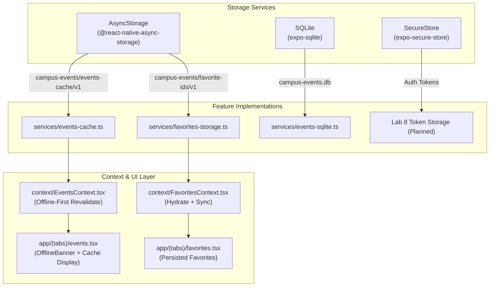

# Implementation Plan: Lab 7 — Local Storage และ Offline Applications

## [Goal Description]
ยกระดับแอปพลิเคชันให้สามารถทำงานแบบ **Offline-First** และจัดเก็บข้อมูลลงในเครื่องอย่างปลอดภัยตามข้อกำหนดของ **Lab 7**:
1. ติดตั้งไลบรารีจัดเก็บข้อมูล: `@react-native-async-storage/async-storage`, `expo-secure-store`, `expo-sqlite`
2. **Favorites Persistence**: บันทึกและกู้คืน (Hydrate) รายการโปรดจาก `AsyncStorage` ผ่านคีย์เวอร์ชัน `campus-events/favorite-ids/v1` พร้อมป้องกัน race condition (ไม่เขียนทับก่อน hydrate เสร็จ)
3. **Offline Read Flow & Event Cache**: แคชรายการกิจกรรมพร้อม `updatedAt` เมื่อเปิดหน้าให้แสดงข้อมูลจากแคชทันที และ revalidate กับ API หากออฟไลน์ให้แสดงแคชเดิมพร้อม **Offline Banner** ระบุเวลาอัปเดตล่าสุด
4. **SQLite Proof-of-concept**: สร้างโมดูล SQLite สำหรับจัดเก็บและค้นหากิจกรรมในเครื่อง
5. **Storage Security Matrix**: แยกแยะประเภทข้อมูลตามเครื่องมือจัดเก็บอย่างถูกต้อง (ไม่เก็บ token ใน AsyncStorage)
6. **Automated Tests**: ทดสอบการ Hydrate, การจัดการ JSON เสีย (corrupted JSON), Offline Banner, และ SQLite POC ให้ผ่าน 100%

---

## User Review Required

> [!IMPORTANT]
> - **Native Dependencies**: การติดตั้ง `@react-native-async-storage/async-storage`, `expo-secure-store`, `expo-sqlite` จะใช้ `npx expo install` เพื่อให้ได้เวอร์ชันที่รองรับกับ Expo SDK 57
> - **Hydration Race Condition Prevention**: `FavoritesContext` จะมีแฟล็ก `isHydrated` เพื่อป้องกันไม่ให้ reducer เริ่มต้นที่เป็นค่าว่าง `[]` ไปเขียนทับข้อมูลใน storage ระหว่างที่กำลังโหลด
> - **Stale-While-Revalidate UX**: เมื่อผู้ใช้เปิดหน้า `/events` แอปจะดึงข้อมูลจากแคชมาแสดงผลทันที (ไม่ให้ผู้ใช้รอนาน) ควบคู่กับการเรียก API ในพื้นหลังเพื่ออัปเดตข้อมูลให้สดใหม่อยู่เสมอ

---

## Architecture Overview



---

## Storage Matrix (เกณฑ์การเลือกพื้นที่จัดเก็บตาม Lab 7)

| เครื่องมือ | ข้อมูลในโปรเจกต์ | เหตุผล |
|---|---|---|
| **AsyncStorage** | - Favorite Event IDs (`favorite-ids/v1`)<br>- Event List Cache (`events-cache/v1`) พร้อม `updatedAt` | ข้อมูลขนาดเล็ก ไม่ใช่ความลับ เข้าถึงแบบ key/value ได้รวดเร็ว |
| **SecureStore** | - Access Token / Refresh Token (Lab 8) | ข้อมูลความลับ/สิทธิ์การเข้าถึง ต้องเข้ารหัสใน Keychain/Keystore |
| **SQLite** | - Structured Events Table (POC)<br>- ค้นหา/กรองตามสถานที่และเวลา | โครงสร้างข้อมูลตารางสัมพันธ์ ค้นหาแบบ query รวดเร็ว |

---

## Proposed Changes

### 1. Dependencies & Jest Configuration

#### [MODIFY] `package.json`
- ติดตั้ง:
  ```bash
  npx expo install @react-native-async-storage/async-storage expo-secure-store expo-sqlite
  ```

#### [MODIFY] `jest.setup.js`
- เพิ่ม mock สำหรับ `@react-native-async-storage/async-storage`
- เพิ่ม mock สำหรับ `expo-secure-store`
- เพิ่ม mock สำหรับ `expo-sqlite`

---

### 2. Services Layer

#### [NEW] `services/favorites-storage.ts`
- จัดการอ่าน/เขียน favorite IDs กับ `AsyncStorage`:
  - `loadFavoriteIds(): Promise<string[]>` (พร้อม Type guard และ try/catch fallback คืนค่า `[]` เมื่อ JSON เสีย)
  - `saveFavoriteIds(ids: string[]): Promise<void>`
  - `clearFavoriteIds(): Promise<void>`

#### [NEW] `services/events-cache.ts`
- จัดการแคชรายการกิจกรรม:
  - `CachedEventsData`: `{ events: CampusEvent[]; updatedAt: string }`
  - `loadEventsCache(): Promise<CachedEventsData | null>`
  - `saveEventsCache(events: CampusEvent[]): Promise<void>`
  - `clearEventsCache(): Promise<void>`

#### [NEW] `services/events-sqlite.ts`
- SQLite Proof-of-concept:
  - ฟังก์ชัน `initDatabase()` สร้างตาราง `events`
  - ฟังก์ชัน `upsertEvents(events: CampusEvent[])`
  - ฟังก์ชัน `queryStoredEvents(): Promise<CampusEvent[]>`

---

### 3. Context & State Layer

#### [MODIFY] `context/FavoritesContext.tsx`
- เพิ่ม `isHydrated: boolean` ใน context value
- ใช้ `useEffect` เรียก `loadFavoriteIds()` เมื่อ mount แล้ว dispatch action `hydrate`
- ใช้ `useEffect` บันทึก `saveFavoriteIds(favorites)` เมื่อ `favorites` เปลี่ยนแปลง **โดยตรวจ `isHydrated === true` ก่อนเสมอ**

#### [MODIFY] `context/EventsContext.tsx`
- เพิ่ม `cachedAt: string | null` และ `isOffline: boolean`
- ปรับแต่ง `fetchEvents()` และ `refreshEvents()`:
  - อ่านข้อมูลจาก cache ขึ้นมาแสดงทันทีก่อน (ถ้ามี)
  - เรียก API ในเบื้องหลัง:
    - ถ้าสำเร็จ: อัปเดต `events`, บันทึก `saveEventsCache`, ตั้ง `cachedAt`, `isOffline = false`
    - ถ้าล้มเหลว: หากมี cache เดิม ให้คงไว้ในจอ ตั้ง `isOffline = true`
    - ถ้าล้มเหลวและไม่มี cache: ตั้ง `fetchStatus = 'error'`

---

### 4. UI Components

#### [NEW] `components/OfflineBanner.tsx`
- แบนเนอร์แสดงสถานะออฟไลน์ แจ้งเตือนผู้ใช้ว่าข้อมูลมาจากแคช พร้อมแสดงเวลาอัปเดตล่าสุด
- Props: `updatedAt: string | null`, `onRetry?: () => void`

#### [MODIFY] `app/(tabs)/events.tsx`
- แสดง `<OfflineBanner />` ด้านบนรายการเมื่อ `isOffline === true`

---

### 5. Automated Tests

#### [NEW] `__tests__/unit/favoritesStorage.test.ts`
- ทดสอบการอ่าน/เขียน favorites
- ทดสอบกรณี corrupted JSON string ใน AsyncStorage
- ทดสอบกรณี schema ผิด (เช่น array มีข้อมูลไม่ใช่ string)

#### [NEW] `__tests__/unit/eventsCache.test.ts`
- ทดสอบการเซฟและโหลด cached events พร้อม timestamp
- ทดสอบกรณี cache ว่างเปล่า หรือ JSON เสีย

#### [NEW] `__tests__/unit/eventsSqlite.test.ts`
- ทดสอบการเปิด database, สร้างตาราง, upsert และ query ข้อมูล

#### [MODIFY] `__tests__/integration/FavoritesScreen.test.tsx`
- ทดสอบว่า favorites คงอยู่เมื่อเปิดหน้าจอใหม่ (Hydration flow)

#### [MODIFY] `__tests__/integration/EventsScreen.test.tsx`
- ทดสอบ Offline flow: เมื่อ API error แต่มี cache จะแสดงรายการจาก cache พร้อม Offline Banner

---

## Verification Plan

### Automated Tests
```bash
# 1. Typecheck
npx tsc --noEmit

# 2. Unit & Integration Tests ทั้งหมด
npm test
```

### Manual Verification
1. เพิ่มกิจกรรมเป็น Favorite จากนั้นรีสตาร์ตแอป (reload) ตรวจสอบว่ากิจกรรมโปรดยังคงอยู่ครบ
2. เปิดหน้ารายการกิจกรรม ทดสอบปิดเน็ตหรือใช้ URL จำลองที่ใช้งานไม่ได้ สังเกตว่าแอปแสดงข้อมูลจากแคชเดิมพร้อม Offline Banner ระบุเวลาอัปเดตล่าสุด
3. กดปุ่ม Favorite และตรวจสอบว่าไม่มีการเขียนทับก่อนที่ข้อมูลเดิมจะ hydrate เสร็จ
